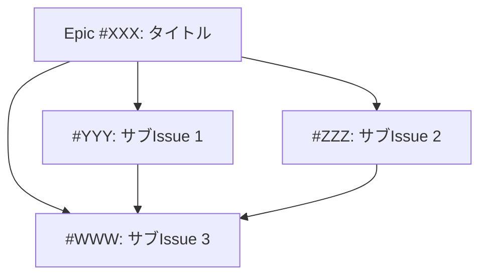

## 📝 概要
<!-- Epicの概要（1-2文） -->

## 💡 動機・背景
<!-- なぜこのEpicが必要か -->

## 🎯 ゴール
<!-- 最終的に達成したいこと -->

## 📊 依存関係グラフ（Mermaid）

## 📋 サブIssue一覧
- [ ] #XXX: サブIssue 1タイトル（size:M, 5h）
- [ ] #YYY: サブIssue 2タイトル（size:S, 3h）
- [ ] #ZZZ: サブIssue 3タイトル（size:M, 6h）

## 📈 進捗
- **完了**: 0/3
- **合計見積もり**: 14h
- **実績**: 0h

## ✅ 全体の受け入れ基準
**Given** [前提条件]
**When** [アクション]
**Then** [期待結果]

- [ ] [基準1: すべてのサブIssueが完了している]
- [ ] [基準2: 統合テストがパスしている]
- [ ] [基準3: ドキュメントが更新されている]

## 📂 Files to Edit（全体）
<!-- Epic全体で編集するファイルの概要 -->
- [ ] src/... (複数ファイル)
- [ ] src/... (複数ファイル)

## 🔗 Dependencies
<!-- Epicレベルの依存関係 -->
- Blocked by: #
- Blocks: #
- Related: #

## 📐 Design Documents
<!-- 関連設計書 -->
- [Architecture](docs/design/architecture.md#section)
- [UI/UX Plan](docs/design/ui-ux-improvement-plan.md#section)

## 🧪 統合テスト要件
- [ ] Epic全体のE2Eテスト追加
- [ ] パフォーマンステスト追加
- [ ] リグレッションテスト追加

## 📚 参考資料
<!-- 関連する記事、ドキュメント、issueのリンク -->

---

## Epic Progress Log
<!-- Epic全体の進捗を記録 -->

### YYYY-MM-DD
- ✅ #XXX: サブIssue 1 完了
- 🚧 #YYY: サブIssue 2 作業中（50%）
- ⏳ #ZZZ: サブIssue 3 未着手

### YYYY-MM-DD
- ✅ #YYY: サブIssue 2 完了
- 🚧 #ZZZ: サブIssue 3 作業中（30%）

---

## File Conflicts（同一ファイル編集の記録）
<!-- サブIssue間でファイル編集が重複する場合の調整記録 -->

### Conflict 1
- **ファイル**: src/lib/photo-service.ts
- **関係するIssue**: #YYY, #ZZZ
- **対応**: #ZZZ は #YYY 完了後に着手（依存関係設定済み）
