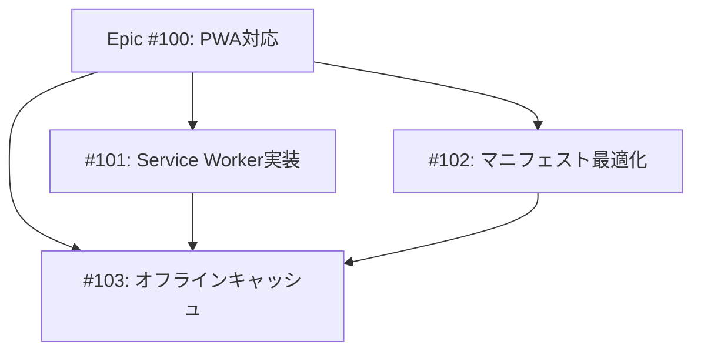

# Issue作成ガイドライン

このドキュメントは、Bite NoteプロジェクトにおけるGitHub Issue作成のベストプラクティスをまとめたものです。

## 🎯 Issue作成の目的

- **トラッキング**: バグ、機能要求、タスクの追跡
- **ドキュメント**: 意思決定の記録
- **コミュニケーション**: チームメンバー間での情報共有
- **優先順位付け**: タスクの整理と計画

---

## 📝 Issueタイトルの書き方

### ルール

- **命令形・現在形を使用**: "Add" not "Adding" or "Added"
- **明確で簡潔に**: 何をするか/何が問題かを一目で理解できる
- **50文字以内推奨**
- **末尾にピリオドを付けない**
- **日本語OK**（個人開発プロジェクトのため）

### 良いタイトルの例

```
✅ スケルトンローディングアニメーションを追加
✅ 写真メタデータ抽出時のメモリリークを修正
✅ 潮汐グラフのレスポンシブ対応を改善
✅ テストカバレッジを70%に向上
```

### 悪いタイトルの例

```
❌ バグ修正
❌ 新機能
❌ UIを更新する予定
❌ いくつかの問題を修正した
```

---

## 🏷️ Issue種類とラベル

### Issue種類

```
🐛 Bug          - バグ報告
✨ Feature      - 新機能要求
🔧 Enhancement  - 既存機能の改善
📚 Documentation - ドキュメント更新
🧪 Testing      - テスト関連
🎨 UI/UX        - UI/UX改善
⚡ Performance  - パフォーマンス改善
♻️ Refactoring  - リファクタリング
🔒 Security     - セキュリティ関連
❓ Question     - 質問・相談
🎯 Epic         - 大規模タスク（複数Issue）
```

### 推奨ラベル

```
priority:high     - 優先度：高
priority:medium   - 優先度：中
priority:low      - 優先度：低

status:to-triage  - トリアージ待ち
status:wip        - 作業中（Work In Progress）
status:blocked    - ブロック中
status:on-hold    - 保留中
status:in-review  - レビュー中

type:bug          - バグ
type:feature      - 新機能
type:enhancement  - 改善
type:docs         - ドキュメント
type:epic         - Epic Issue

size:S            - 小規模（2-4h, 1-3ファイル）
size:M            - 中規模（4-8h, 3-5ファイル）
size:L            - 大規模（8-16h, 5-10ファイル） ← Epic分割推奨
```

---

## 📋 Issue本文テンプレート

### 🐛 バグ報告テンプレート

```markdown
## 📝 概要
[バグの簡潔な説明]

## 🔄 再現手順
1. [手順1]
2. [手順2]
3. [手順3]

## 💥 期待される動作
[本来どう動作すべきか]

## 🐛 実際の動作
[実際に何が起こるか]

## 🖼️ スクリーンショット
[スクリーンショット（該当する場合）]

## 🌍 環境
- OS: [例: macOS 14.0]
- ブラウザ: [例: Chrome 120]
- Node.js: [例: v20.10.0]
- デバイス: [例: iPhone 15 Pro]

## 📊 再現頻度
- [ ] 常に再現する
- [ ] 時々再現する
- [ ] 稀に再現する

## 💡 追加情報
[その他関連する情報]

## 🔗 関連Issue
#XX, #YY
```

### ✨ 機能要求テンプレート

```markdown
## 📝 概要
[機能の簡潔な説明]

## 💡 動機・背景
[なぜこの機能が必要か]

## 🎯 期待される動作
[機能の詳細な説明]

## ✅ 受け入れ基準
- [ ] [基準1]
- [ ] [基準2]
- [ ] [基準3]

## 🎨 UI/UXイメージ
[ワイヤーフレーム、モックアップ、スクリーンショット]

## 🧪 テスト要件
- [ ] ユニットテスト追加
- [ ] コンポーネントテスト追加
- [ ] E2Eテスト追加

## 📚 参考資料
[関連する記事、ドキュメント、issueのリンク]

## 🔗 関連Issue
#XX, #YY
```

### 🔧 改善提案テンプレート

```markdown
## 📝 概要
[改善内容の簡潔な説明]

## 🎯 現状の問題
[現在の実装の何が問題か]

## 💡 提案する改善
[どう改善するか]

## ✅ 期待される効果
- [効果1: 例: パフォーマンス30%向上]
- [効果2: 例: コードの可読性向上]
- [効果3: 例: 保守性向上]

## 🧪 検証方法
[改善効果をどう測定するか]

## 🔗 関連Issue
#XX, #YY
```

---

## ✅ Issue作成前チェックリスト

### 作成前に確認

- [ ] **重複チェック**: 既存のissueを検索して重複がないか確認
- [ ] **明確性**: タイトルと本文が明確で理解しやすいか
- [ ] **完全性**: 必要な情報が全て含まれているか
- [ ] **適切なラベル**: 種類と優先度のラベルを付与
- [ ] **関連性**: 関連するissueやPRをリンク

### 作成後

- [ ] **トリアージ**: 優先度を設定
- [ ] **マイルストーン**: 該当する場合は設定
- [ ] **アサイン**: 担当者を設定（個人開発では自分）

---

## 🔍 良いIssueの特徴

### ✅ DO（推奨）

- **1 Issue = 1つの問題/機能**: 明確な範囲設定
- **具体的**: 曖昧な表現を避ける
- **再現可能**: バグは再現手順を詳細に記載
- **コンテキスト**: 背景情報を十分に提供
- **スクリーンショット**: UI関連は視覚的に示す
- **関連リンク**: 参考資料や関連issueを記載

### ❌ DON'T（避ける）

- **曖昧な記述**: "うまく動かない"、"変な動き"
- **複数の問題を1つに**: バグと機能要求を混在させる
- **不完全な情報**: 再現手順や環境情報の欠落
- **感情的な表現**: "最悪"、"ひどい"等の主観的表現
- **長すぎる**: 必要以上に冗長な説明

---

## 🔄 Issue駆動開発のベストプラクティス

### タスク粒度の判断基準

**1 Issue = 1 PR の原則**を守り、以下の粒度を目安にする：

- **推奨作業時間**: 2-6時間（1セッション完結）
- **ファイル数の目安**: 1-5ファイル（テスト含む10ファイルまで許容）
- **コミット数の目安**: 1-3コミット
- **見積もりラベル**: size:S (2-4h), size:M (4-8h), size:L (8-16h)

```
✅ 良い粒度の例:
- "写真EXIF情報からGPS座標を自動入力する機能"
  → 2-6時間、3-5ファイル、1 PR

❌ 粒度が大きすぎる例:
- "写真管理機能の実装"
  → 16時間以上、10ファイル以上、複数PR必要
  → Epic Issueとして分割が必要

❌ 粒度が小さすぎる例:
- "PhotoUpload.tsxに型定義を追加"
  → 30分、1ファイル、些細な変更
  → 他のタスクに含めるべき
```

### 依存関係の表現

Issue本文に以下のセクションを追加：

```markdown
## 🔗 Dependencies
- Blocked by: #123, #124
- Blocks: #125
- Related: #126, #127
```

**Epic Issueの場合**: Mermaidで依存関係グラフを作成：

```markdown
## 依存関係グラフ（Mermaid）

```

### 編集対象ファイルの記載

**2段階管理**で実施：

```markdown
## 📂 Files to Edit

### 予定（事前）
- [ ] src/lib/photo-service.ts
- [ ] src/lib/photo-service.test.ts
- [ ] src/types/photo.ts (?)  ← 不確定なファイルは「?」付与

### 実績（作業中〜完了時）
- [x] src/lib/photo-service.ts
- [x] src/lib/photo-service.test.ts
- [x] src/types/photo.ts ← 実際に編集したファイル
- [x] src/lib/exif-utils.ts ← 作業中に追加されたファイル
```

**重要**: 作業開始前に他のWIP Issueの「Files to Edit実績」と重複チェック

### セッション引き継ぎ

各セッション後にSession Notesを更新：

```markdown
## Session Notes

### Session 1 (2025-11-07 10:00)
- **実施内容**: photo-service.ts のEXIF抽出ロジック実装完了
- **完了項目**: ✅ src/lib/photo-service.ts
- **未完了項目**: ❌ src/lib/photo-service.test.ts (未着手)
- **技術メモ**: ExifReader v4.31.2 を使用、GPS取得は navigator.geolocation と併用
- **ブロッカー**: なし

### Session 2 (2025-11-07 14:00)
- **実施内容**: テストコード追加、qa-engineerレビュー完了
- **完了項目**: ✅ src/lib/photo-service.test.ts
- **技術メモ**: モック作成時に注意が必要（非同期処理）
- **次回**: tech-leadレビュー依頼
```

---

## 🔄 Issueのライフサイクル

```
Open (作成)
  ↓
To Triage (トリアージ待ち)
  ↓
In Progress (作業中)
  ↓
In Review (レビュー中)
  ↓
Done (完了) / Closed (クローズ)
```

### ステータス更新

- **作業開始時**: `status:in-progress` ラベルを追加
- **PR作成時**: PRリンクをコメント
- **完了時**: "Closes #XX" をPRに記載して自動クローズ
- **保留時**: `status:on-hold` ラベルと理由をコメント
- **ブロック時**: `status:blocked` ラベルとブロック理由をコメント

---

## 📊 Issue管理のベストプラクティス

### 定期的なレビュー

- **週次**: 新しいissueをトリアージ
- **月次**: 古いissueをレビューしてクローズまたは更新

### コメント活用

- **進捗更新**: 作業の進捗を定期的にコメント
- **質問**: 不明点があればコメントで確認
- **決定事項**: 重要な決定はコメントで記録

### クローズ条件

- **完了**: タスク完了、機能実装完了
- **修正済み**: バグ修正済み、検証完了
- **重複**: 既存issueと重複
- **対応不要**: 仕様として意図した動作
- **対応しない**: 優先度が低く対応しないと決定

---

## 🛠️ GitHubの機能活用

### Issue Template（推奨）

```bash
# .github/ISSUE_TEMPLATE/ ディレクトリ作成
mkdir -p .github/ISSUE_TEMPLATE

# バグ報告テンプレート
# .github/ISSUE_TEMPLATE/bug_report.md

# 機能要求テンプレート
# .github/ISSUE_TEMPLATE/feature_request.md
```

### Automation

```yaml
# .github/workflows/triage.yml
# 新しいissueに自動でラベル付与
```

---

## 📚 参考資料

- [Rewind: Best Practices for Using GitHub Issues](https://rewind.com/blog/best-practices-for-using-github-issues/)
- [Tilburg Science Hub: Best Practices for GitHub Issues Management](https://tilburgsciencehub.com/topics/automation/version-control/start-git/write-good-issues/)
- [Zenhub: GitHub Best Practices - Taking Issues from Good to Great](https://blog.zenhub.com/best-practices-for-github-issues/)
- [GitHub Community: Best Practices for Writing Effective GitHub Issues](https://github.com/orgs/community/discussions/147722)

---

**Last Updated**: 2025-11-06
