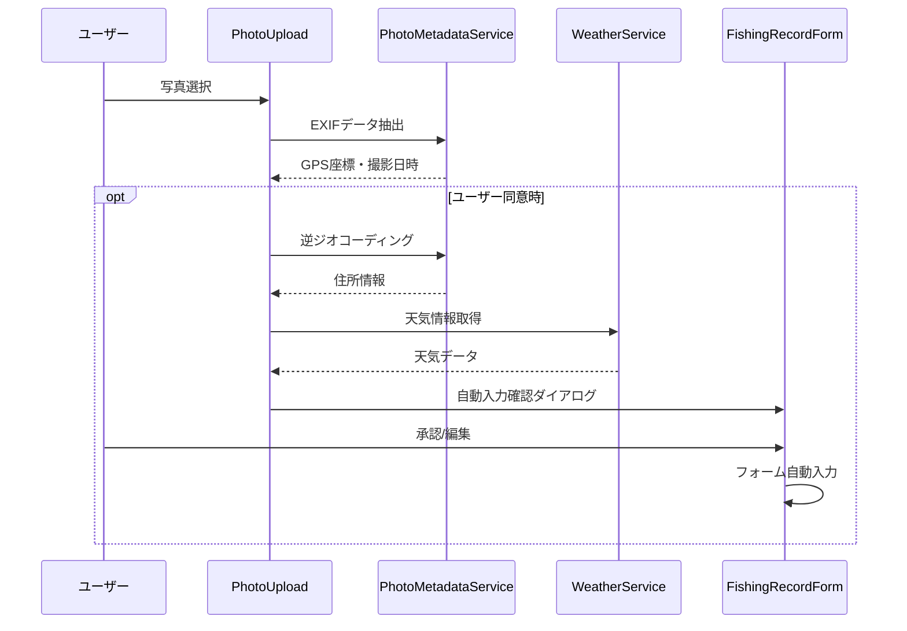

# 写真メタデータ自動入力機能 設計書

## 概要

写真のEXIFデータから位置情報・撮影日時を自動抽出し、さらに天気情報も自動取得して釣果記録フォームに自動入力する機能の詳細設計。

## 機能要件

### 自動取得対象データ
1. **EXIFデータ**
   - GPS座標（緯度・経度・精度）
   - 撮影日時（日付・時刻・タイムゾーン）
   - カメラ情報（機種・設定値）

2. **派生データ**
   - 住所（逆ジオコーディング）
   - 天気情報（気温・湿度・風速・気圧・天候）

## アーキテクチャ設計

### コンポーネント構成

```typescript
// 新規サービスクラス
PhotoMetadataService  // EXIF抽出・逆ジオコーディング
WeatherService       // 天気API統合
AutoFillService      // 自動入力フロー制御

// 既存コンポーネント拡張
PhotoUpload          // メタデータ抽出機能追加
FishingRecordForm    // 自動入力UI追加
FishingRecordDetail  // 天気情報表示追加
```

### データフロー



## 実装仕様

### 1. PhotoMetadataService

```typescript
interface PhotoMetadata {
  coordinates?: Coordinates;
  datetime?: Date;
  camera?: CameraInfo;
  location?: string;
  weather?: WeatherData;
}

interface CameraInfo {
  make?: string;
  model?: string;
  settings?: {
    fNumber?: number;
    exposureTime?: string;
    iso?: number;
  };
}

class PhotoMetadataService {
  // EXIF抽出（メモリ内処理のみ）
  async extractMetadata(file: File): Promise<PhotoMetadata>;

  // 逆ジオコーディング（Nominatim API）
  async getLocationFromCoordinates(coords: Coordinates): Promise<string>;

  // 座標の妥当性チェック
  validateCoordinates(coords: Coordinates): boolean;

  // プライバシー確認
  hasPrivacyConsent(): boolean;
}
```

### 2. WeatherService

```typescript
interface WeatherData {
  condition: string;        // 晴れ、雨、曇り等
  temperature: number;      // 気温 (°C)
  humidity: number;         // 湿度 (%)
  windSpeed: number;        // 風速 (m/s)
  pressure: number;         // 気圧 (hPa)
  icon: string;            // 天気アイコンID
  description: string;      // 詳細説明
}

class WeatherService {
  private readonly API_KEY: string;
  private readonly BASE_URL = 'https://api.openweathermap.org/data/2.5';

  // 過去の天気データ取得
  async getHistoricalWeather(
    coords: Coordinates,
    datetime: Date
  ): Promise<WeatherData>;

  // 現在の天気データ取得
  async getCurrentWeather(coords: Coordinates): Promise<WeatherData>;

  // API制限チェック
  canMakeApiCall(): boolean;

  // キャッシュ管理
  getCachedWeather(coords: Coordinates, datetime: Date): WeatherData | null;
}
```

### 3. AutoFillService

```typescript
interface AutoFillData {
  location?: string;
  coordinates?: Coordinates;
  date?: Date;
  weather?: WeatherData;
  source: 'exif' | 'manual' | 'gps';
}

class AutoFillService {
  // 写真からの自動データ抽出
  async extractFromPhoto(file: File): Promise<AutoFillData>;

  // 自動入力確認ダイアログの表示判定
  shouldShowConfirmation(data: AutoFillData): boolean;

  // ユーザー同意の管理
  async requestUserConsent(data: AutoFillData): Promise<boolean>;

  // フォームへの自動入力実行
  applyToForm(data: AutoFillData, formState: any): void;
}
```

## UI/UX設計

### 1. 自動入力確認ダイアログ

```tsx
interface AutoFillConfirmationProps {
  metadata: PhotoMetadata;
  onConfirm: (approved: AutoFillData) => void;
  onCancel: () => void;
}

const AutoFillConfirmation: React.FC<AutoFillConfirmationProps> = ({
  metadata,
  onConfirm,
  onCancel
}) => {
  return (
    <Modal title="写真から情報を自動入力しますか？">
      <div className="space-y-4">
        {metadata.datetime && (
          <Field label="撮影日時" value={formatDate(metadata.datetime)} />
        )}

        {metadata.location && (
          <Field label="撮影場所" value={metadata.location} />
        )}

        {metadata.weather && (
          <Field
            label="天気"
            value={`${metadata.weather.condition} ${metadata.weather.temperature}°C`}
          />
        )}

        <div className="flex gap-2">
          <Button onClick={onCancel} variant="secondary">
            手動入力する
          </Button>
          <Button onClick={() => onConfirm(metadata)} variant="primary">
            自動入力する
          </Button>
        </div>
      </div>
    </Modal>
  );
};
```

### 2. PhotoUpload拡張

```tsx
interface PhotoUploadProps {
  onPhotoSelect: (file: File, metadata?: PhotoMetadata) => void;
  autoFillEnabled: boolean;
}

const PhotoUpload: React.FC<PhotoUploadProps> = ({
  onPhotoSelect,
  autoFillEnabled
}) => {
  const [extracting, setExtracting] = useState(false);

  const handleFileSelect = async (file: File) => {
    if (!autoFillEnabled) {
      onPhotoSelect(file);
      return;
    }

    setExtracting(true);
    try {
      const metadata = await photoMetadataService.extractMetadata(file);
      if (metadata.coordinates || metadata.datetime) {
        // 自動入力確認ダイアログを表示
        showAutoFillConfirmation(file, metadata);
      } else {
        onPhotoSelect(file);
      }
    } catch (error) {
      console.error('メタデータ抽出失敗:', error);
      onPhotoSelect(file);
    } finally {
      setExtracting(false);
    }
  };

  return (
    <div className="photo-upload">
      {extracting && (
        <div className="overlay">
          <Spinner />
          <span>写真の情報を読み取り中...</span>
        </div>
      )}

      <input
        type="file"
        accept="image/*"
        onChange={(e) => e.target.files?.[0] && handleFileSelect(e.target.files[0])}
      />
    </div>
  );
};
```

### 3. 天気情報表示コンポーネント

```tsx
interface WeatherDisplayProps {
  weather: WeatherData;
  compact?: boolean;
}

const WeatherDisplay: React.FC<WeatherDisplayProps> = ({
  weather,
  compact = false
}) => {
  return (
    <div className={`weather-display ${compact ? 'compact' : ''}`}>
      <div className="weather-icon">
        
      </div>

      <div className="weather-info">
        <div className="condition">{weather.condition}</div>
        <div className="temperature">{weather.temperature}°C</div>

        {!compact && (
          <div className="details">
            <span>湿度: {weather.humidity}%</span>
            <span>風速: {weather.windSpeed}m/s</span>
            <span>気圧: {weather.pressure}hPa</span>
          </div>
        )}
      </div>
    </div>
  );
};
```

## プライバシー・セキュリティ

### データ保護
- EXIFデータはメモリ内でのみ処理
- サーバーへの生データ送信は一切なし
- ユーザーの明示的同意後のみ処理実行

### 同意管理
```typescript
interface PrivacySettings {
  photoMetadataConsent: boolean;
  weatherDataConsent: boolean;
  locationSharingConsent: boolean;
  lastConsentDate: Date;
}

class PrivacyManager {
  // 初回利用時の同意取得
  async requestInitialConsent(): Promise<PrivacySettings>;

  // 設定での同意管理
  updateConsent(settings: Partial<PrivacySettings>): void;

  // 同意状況の確認
  hasValidConsent(feature: string): boolean;
}
```

## エラーハンドリング

### エラー種別と対応
1. **EXIFデータなし** → 手動入力へフォールバック
2. **GPS情報不正** → 現在位置取得を提案
3. **天気API失敗** → 天気情報なしで記録保存
4. **ネットワークエラー** → オフライン処理継続

### エラー表示UI
```tsx
const ErrorFallback: React.FC<{error: string, onRetry: () => void}> = ({
  error,
  onRetry
}) => {
  return (
    <div className="error-fallback">
      <Icon name="warning" />
      <span>{error}</span>
      <Button onClick={onRetry} size="small">
        再試行
      </Button>
    </div>
  );
};
```

## パフォーマンス考慮

### 最適化戦略
- EXIF抽出の非同期処理
- 天気API呼び出しの制限・キャッシュ
- 逆ジオコーディングの結果キャッシュ
- メタデータ抽出の並列処理

### メモリ管理
- 大容量画像ファイルの段階的読み込み
- 処理後の即座なメモリ解放
- WeakMapを活用したキャッシュ管理

## テスト戦略

### ユニットテスト
- EXIFデータ抽出ロジック
- 天気API呼び出し
- エラーハンドリング

### 統合テスト
- 写真アップロード→自動入力フロー
- プライバシー同意管理
- オフライン対応

### E2Eテスト
- 完全な自動入力フロー
- エラー状況での適切な処理
- モバイルデバイス対応

## 実装スケジュール

### Phase 1: EXIF抽出 (3日)
- PhotoMetadataService実装
- PhotoUpload拡張
- 基本的なプライバシー同意

### Phase 2: 天気API統合 (2日)
- WeatherService実装
- API制限・キャッシュ管理
- エラーハンドリング

### Phase 3: UI統合 (2日)
- 自動入力確認ダイアログ
- フォーム自動入力機能
- 天気情報表示

### Phase 4: テスト・最適化 (1日)
- テスト実装
- パフォーマンス最適化
- ドキュメント整備

**総実装期間**: 8日間