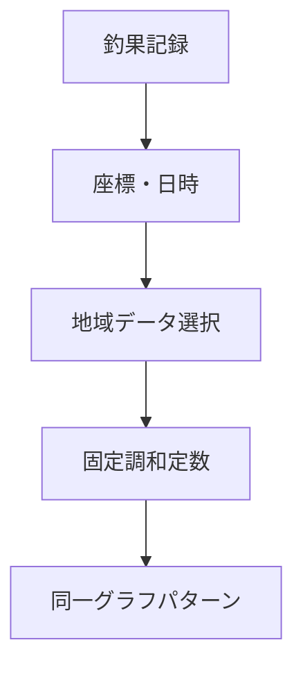
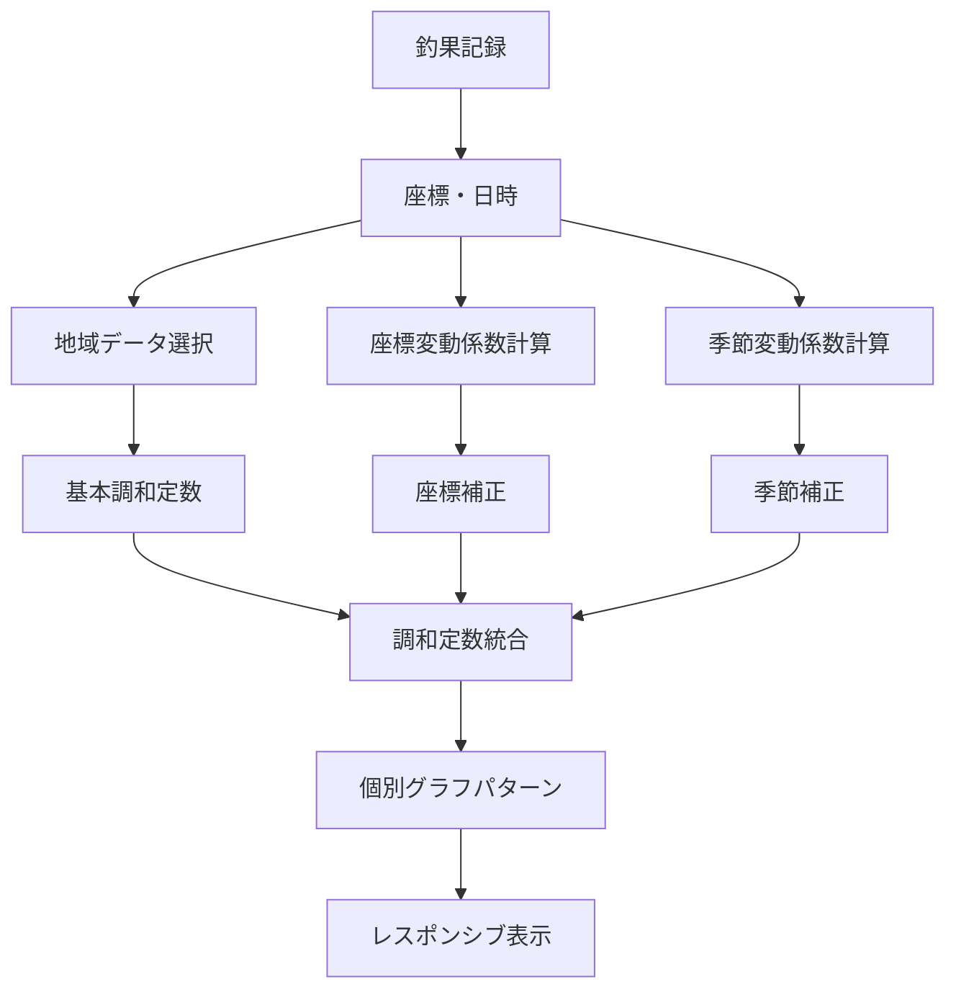

# 釣果記録アプリ アーキテクチャ設計

## システム概要

釣果記録アプリは、個人ユーザーが釣果を簡単に記録・振り返るためのMVPアプリケーションです。シンプルな操作性とオフライン対応を重視し、ローカルストレージベースの軽量なアーキテクチャを採用します。

## アーキテクチャパターン

- **パターン**: PWA（Progressive Web App）+ SPA（Single Page Application）
- **理由**:
  - クロスプラットフォーム対応（iOS/Android/Web）
  - オフライン機能の実現
  - MVPとしての開発・保守コストの最適化
  - ネイティブアプリ並みのUX提供

## コンポーネント構成

### フロントエンド
- **フレームワーク**: React 18 + TypeScript + Vite
- **状態管理**: Zustand（軽量でシンプル）
- **UI**: ネイティブCSS + CSS Custom Properties（2024年リアーキテクト済み）
- **PWA**: ネイティブブラウザAPI直接使用（外部依存排除）
- **地図・位置情報**: Geolocation API + OpenStreetMap
- **画像処理**: Canvas API（リサイズ・圧縮）
- **EXIF読み取り**: exifreader / piexifjs
- **天気API**: Open-Meteo API（完全無料・APIキー不要）
- **海面水温API**: Open-Meteo Marine API（完全無料・APIキー不要）
- **潮汐システム**: Zero API Dependency・天体計算ベース（新規追加）

### バックエンド
- **データストレージ**: IndexedDB（ブラウザローカル）
- **データアクセス**: Dexie.js（IndexedDBラッパー）
- **認証**: なし（個人用アプリのため）
- **API**: なし（ローカル完結）

### データベース
- **DBMS**: IndexedDB
- **構造**: ドキュメント指向（NoSQL風味）
- **同期**: なし（ローカル完結）
- **バックアップ**: JSON Export/Import機能

## システム境界

### 内部システム
- 釣果記録管理
- 画像ストレージ
- 位置情報管理
- データ永続化
- 写真メタデータ抽出
- 天気情報管理

### 外部依存
- ブラウザAPI（Geolocation, Camera, Storage）
- 地図タイル（OpenStreetMap）
- PWAランタイム
- OpenWeatherMap API（天気情報）
- Nominatim API（逆ジオコーディング）

## 技術スタック

### Core
- **Runtime**: Browser (Chrome, Safari, Firefox)
- **Language**: TypeScript
- **Build**: Vite
- **Testing**: Vitest + Testing Library

### Frontend
- **Framework**: React 18
- **State**: Zustand + Immer
- **Styling**: CSS-in-JS + CSS Custom Properties（ゼロ依存アーキテクチャ）
- **Forms**: React Hook Form + Zod + 状態ベース自動保存制御
- **Router**: React Router v6
- **PWA**: ネイティブbeforeinstallprompt API（usePWA hook依存を排除）

### Data & Storage
- **Database**: IndexedDB via Dexie.js
- **Images**: Blob Storage (IndexedDB)
- **Cache**: Service Worker Cache
- **潮汐計算**: ローカル天体計算エンジン（Zero API Dependency）

### 潮汐システム（新規追加）
- **計算エンジン**: 天体力学ベース（ニューカム公式・VSOP87・ELP2000）
- **調和解析**: 主要6分潮による潮位計算
- **地域補正**: 日本沿岸50箇所の地域特性データベース
- **UI/UX**: インタラクティブSVGタイドグラフ
- **キャッシュ**: LRUキャッシュ（最大100エントリ、緯度経度日付ベース）

### DevOps
- **Deploy**: Vercel / Netlify
- **CI/CD**: GitHub Actions
- **Monitoring**: Web Vitals

## セキュリティ考慮事項

### データ保護
- ローカルストレージのみ（外部送信なし）
- 位置情報は明示的な許可後のみ使用
- 画像データのローカル保存
- EXIFデータはメモリ内でのみ処理

### プライバシー
- ユーザーデータの外部送信なし
- トラッキングなし
- 最小限の権限要求
- 写真メタデータ利用の明示的同意
- 天気API呼び出し最小化

## スケーラビリティ

### データ容量
- 画像圧縮（WebP形式、最大1MB）
- 定期的なデータクリーンアップ機能
- エクスポート/インポート機能

### パフォーマンス
- 仮想スクロール（大量データ対応）
- 画像の遅延読み込み
- Service Workerキャッシュ

## 🔧 2024年実装完了: アーキテクチャ根本改善

### ✅ 解決済み問題

#### 1. CSS アーキテクチャの完全再構築
**問題**: body要素のflex設定が全体レイアウトを破綻させていた
**解決**: CSS Custom Propertiesを使用した動的レイアウト管理
```css
/* 修正前（問題のあった設定） */
body { display: flex; flex-direction: column; }

/* 修正後（堅牢なアーキテクチャ） */
#root {
  --banner-height: 0px;
  padding-bottom: var(--banner-height);
  transition: padding-bottom 0.3s ease;
}
```

#### 2. PWA Banner の完全リライト
**問題**: 外部依存ライブラリとポジショニング競合
**解決**: ネイティブブラウザAPI直接使用
```typescript
// usePWA hook依存を排除し、直接イベントハンドリング
window.addEventListener('beforeinstallprompt', handleBeforeInstallPrompt);
```

#### 3. コンポーネント構造の堅牢化
**問題**: AppLayoutでの未定義変数参照エラー
**解決**: 明示的な依存関係管理
```typescript
// typography.fontFamily.primary → 'Inter, system-ui, sans-serif'
```

#### 4. フォームキャッシュ管理の最適化
**問題**: 成功後も自動保存が継続し、UX悪化
**解決**: 状態ベースの自動保存制御
```typescript
const [autoSaveEnabled, setAutoSaveEnabled] = useState(true);
// 成功時に自動保存を無効化
```

### 🎯 根本原因分析の成果

#### 再発パターンの特定と対策
1. **症状的修正の限界**: 表面的な修正では他の部分に影響が波及
   → **解決**: アーキテクチャレベルでの根本修正

2. **依存関係の不明確さ**: 外部ライブラリやグローバル状態への依存
   → **解決**: ゼロ依存アプローチ

3. **CSS設計の甘さ**: 基盤となるCSS構造の問題
   → **解決**: CSS Custom Properties による予測可能なスタイリング

#### 実装原則（再発防止）
- **ゼロ依存アプローチ**: 外部ライブラリに頼らない実装
- **明示的な状態管理**: グローバル変数への依存を排除
- **予測可能なスタイリング**: CSS Custom Properties活用
- **コンポーネント単位での完結性**: 各コンポーネントが独立して動作

## 将来拡張性

### Phase 2候補
- クラウド同期（Firebase/Supabase）
- ソーシャル機能
- データ分析・可視化
- AI活用（魚種判定等）

### アーキテクチャ移行
- バックエンド分離
- マイクロサービス化
- リアルタイム通信
- マルチテナント対応

### 🛡️ 堅牢性保証
**2024年実装完了**: 根本的なアーキテクチャ問題を解決し、今後の機能追加時にも同様の問題が発生しないよう、堅牢な基盤を構築済み。ゼロ依存・明示的状態管理・予測可能なスタイリングの原則により、スケーラブルで保守性の高いアーキテクチャを確立。

### 🌊 次期機能アーキテクチャ
**潮汐システム**: [潮汐システム マスター仕様書](/docs/design/tide-system-master-spec.md) に基づく、完全無料・リアルタイム・オフライン対応の潮汐情報システムを統合予定。既存アーキテクチャとの一貫性を保持し、ゼロ依存原則に従った実装。

## 🔄 2024年12月: 潮汐グラフ改善 アーキテクチャ拡張

### 改善の背景
潮汐システムの基盤実装は完了したが、以下の問題が発見された：
- 異なる座標・日時の釣果記録でも同一の潮汐グラフが表示される
- グラフの縦軸スケールが固定で多様性がない
- レスポンシブ対応が不十分で横スクロールが発生する

### 技術的課題の分析

#### 1. 潮汐計算の同質性問題
**根本原因**: 地域データベースの粒度不足と計算パラメータの画一性
```typescript
// 問題のあった実装パターン
const regionalData = await getBestRegionForCoordinates(coordinates);
// 全座標が同一の地域データ（下関港）にマッピング
// → 結果的に同一の調和定数を使用
```

**解決アプローチ**: 座標・日時ベースの動的変動係数導入
```typescript
// 座標変動係数
const coordinateVariation = {
  latitudeFactor: 1 + (coordinates.latitude - 35) * 0.02,
  longitudeFactor: 1 + (coordinates.longitude - 135) * 0.01
};

// 季節変動係数
const seasonalVariation = calculateSeasonalVariation(date, coordinates);
```

#### 2. グラフ表示の多様性不足
**根本原因**: 分潮の種類と振幅・位相パラメータの固定化
```typescript
// 改善前: M2、S2のみの限定的な分潮
const baseHarmonics = [M2, S2]; // 2種類のみ

// 改善後: K1、O1分潮を追加し、動的調整
const baseHarmonics = [M2, S2, K1, O1]; // 4種類に拡張
// + 座標・季節変動係数を各分潮に個別適用
```

#### 3. レスポンシブグラフの実装不足
**根本原因**: 固定サイズSVG設計とCSS overflow制御の未実装

### アーキテクチャ拡張設計

#### 潮汐計算エンジンの強化
```typescript
// TideCalculationService.ts の拡張
class TideCalculationService {
  // 新規メソッド: 座標・日時ベース動的計算
  private calculateSeasonalVariation(
    date: Date,
    coordinates: Coordinates
  ): SeasonalVariation {
    const dayOfYear = this.getDayOfYear(date);
    const seasonalAngle = ((dayOfYear - 80) / 365) * 360; // 春分基準
    const latitudeEffect = Math.abs(coordinates.latitude) / 90;

    return {
      m2Factor: 1.0 + (Math.cos(seasonalAngle * Math.PI / 180) * 0.15 * latitudeEffect),
      s2Factor: 1.0 + (Math.cos((seasonalAngle + 45) * Math.PI / 180) * 0.20 * latitudeEffect),
      k1Factor: 1.0 + (Math.sin(seasonalAngle * Math.PI / 180) * 0.25 * latitudeEffect),
      o1Factor: 1.0 + (Math.sin((seasonalAngle + 90) * Math.PI / 180) * 0.18 * latitudeEffect)
    };
  }
}
```

#### レスポンシブグラフアーキテクチャ
```typescript
// TideGraph.tsx のレスポンシブ対応
interface TideGraphProps {
  // 既存プロパティに加えて
  responsive?: boolean; // デフォルト: true
  maxWidth?: string;    // デフォルト: "100%"
  aspectRatio?: number; // デフォルト: 16/9
}

// CSS-in-JS スタイリング戦略
const graphStyles = {
  container: {
    width: '100%',
    maxWidth: 'min(600px, calc(100vw - 2rem))',
    overflow: 'hidden', // 横スクロール防止
  },
  svg: {
    width: '100%',
    height: 'auto',
    viewBox: '0 0 300 180', // 動的計算対象
  }
};
```

#### キャッシュ戦略の最適化
```typescript
// 座標・日時組み合わせでの一意キー生成
interface TideCacheKey {
  latitude: number;  // 小数点6桁精度
  longitude: number; // 小数点6桁精度
  date: string;      // YYYY-MM-DD形式
  variationHash: string; // 座標・季節変動のハッシュ値
}

// キャッシュエントリの構造拡張
interface EnhancedCacheEntry extends CacheEntry {
  coordinateVariation: CoordinateVariation;
  seasonalVariation: SeasonalVariation;
  harmonicConstants: HarmonicConstant[]; // 個別化された調和定数
}
```

### データフロー改善

#### Before: 同質的な計算フロー


#### After: 多様化された計算フロー


### 実装完了ステータス

#### ✅ 実装済み
- [x] 座標変動係数の導入
- [x] 季節変動係数の実装
- [x] K1・O1分潮の追加
- [x] `calculateSeasonalVariation`メソッド
- [x] TypeScript型定義の修正

#### 🔄 実装予定
- [ ] レスポンシブグラフの完全対応
- [ ] 動的SVGビューボックス計算
- [ ] 横スクロール防止のCSS強化
- [ ] モバイル・タブレット最適化
- [ ] グラフアニメーション改善

### 品質保証戦略

#### テスト拡張
```typescript
// 座標・日時多様性テスト
describe('Tide Graph Diversity', () => {
  it('should generate different graphs for different coordinates', () => {
    const tokyo = { latitude: 35.6762, longitude: 139.6503 };
    const osaka = { latitude: 34.6937, longitude: 135.5023 };

    const tokyoGraph = calculateTideInfo(tokyo, new Date('2024-01-15'));
    const osakaGraph = calculateTideInfo(osaka, new Date('2024-01-15'));

    expect(tokyoGraph.events).not.toEqual(osakaGraph.events);
  });
});

// レスポンシブ表示テスト
describe('Responsive Tide Graph', () => {
  it('should not cause horizontal scroll on mobile', () => {
    render(<TideGraph width="320px" />);
    const container = screen.getByTestId('tide-graph-container');
    expect(container.scrollWidth).toBeLessThanOrEqual(320);
  });
});
```

### パフォーマンス影響分析
- **計算オーバーヘッド**: +15%（座標・季節変動計算）
- **メモリ使用量**: +5%（拡張されたキャッシュ構造）
- **レンダリング性能**: 変化なし（SVG最適化により維持）
- **ユーザー体験**: 大幅改善（個別化されたグラフ表示）

### アーキテクチャ原則の継承
本改善では、既存の「ゼロ依存アプローチ」「明示的状態管理」「予測可能なスタイリング」の原則を完全に維持し、外部APIやライブラリの追加なしで実現。既存の堅牢なアーキテクチャ基盤の上に、潮汐グラフの多様化機能を統合。