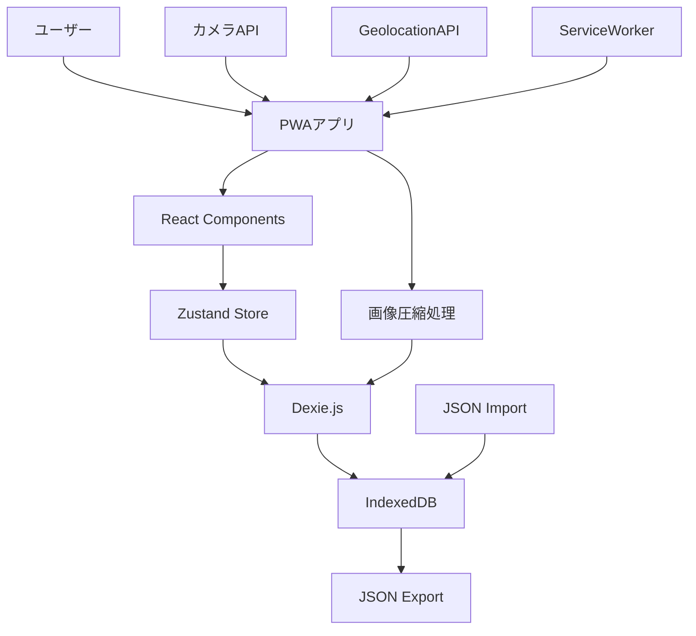
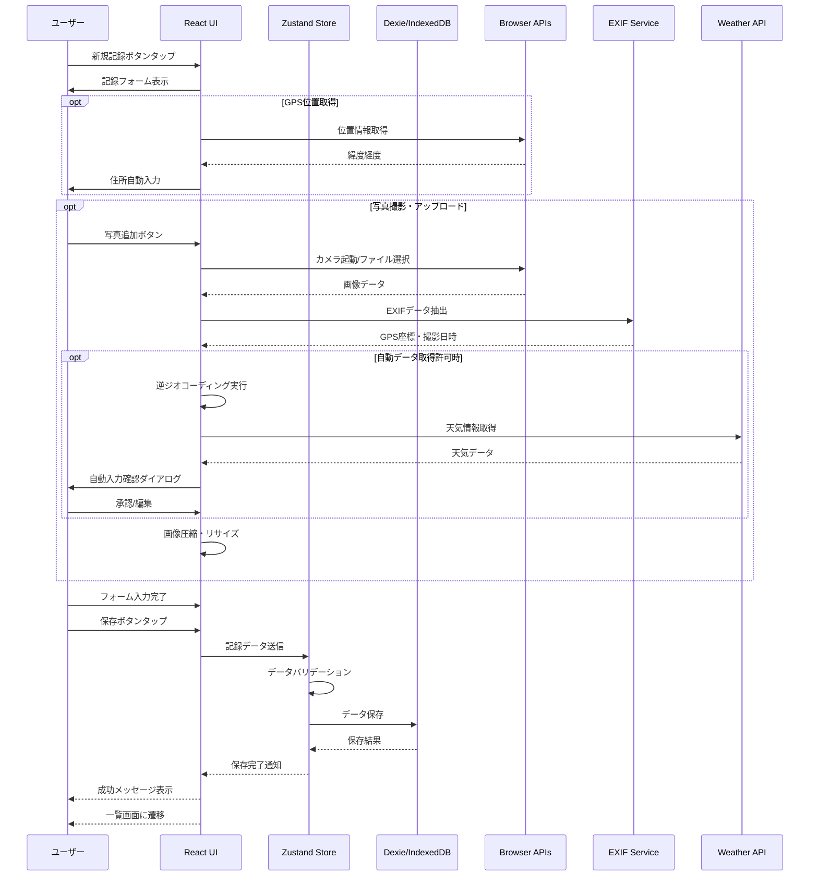
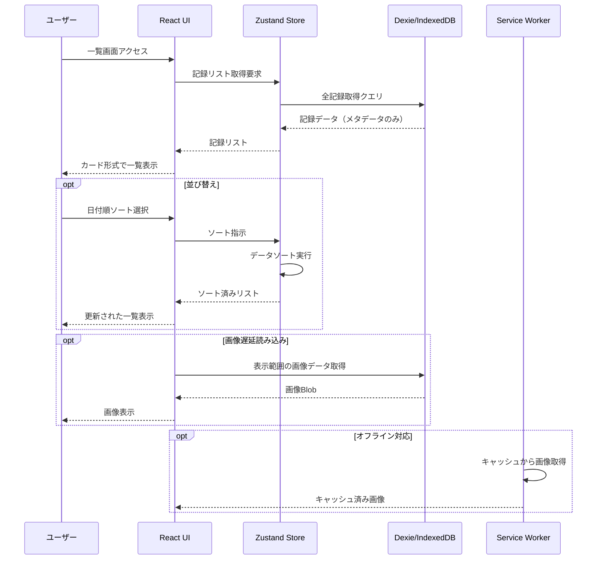
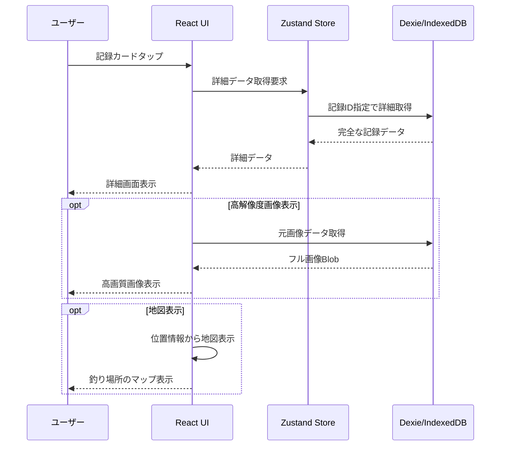
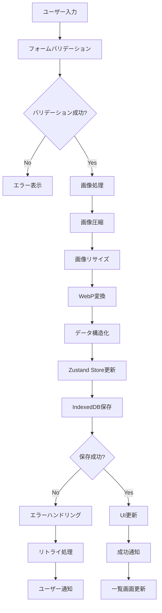
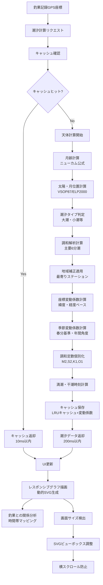
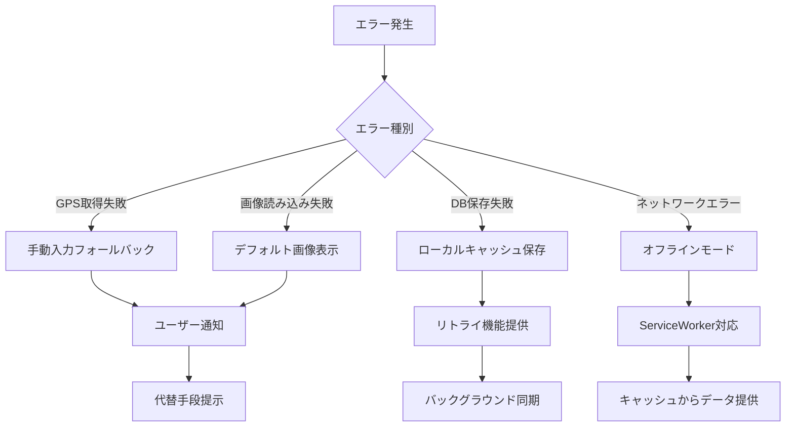
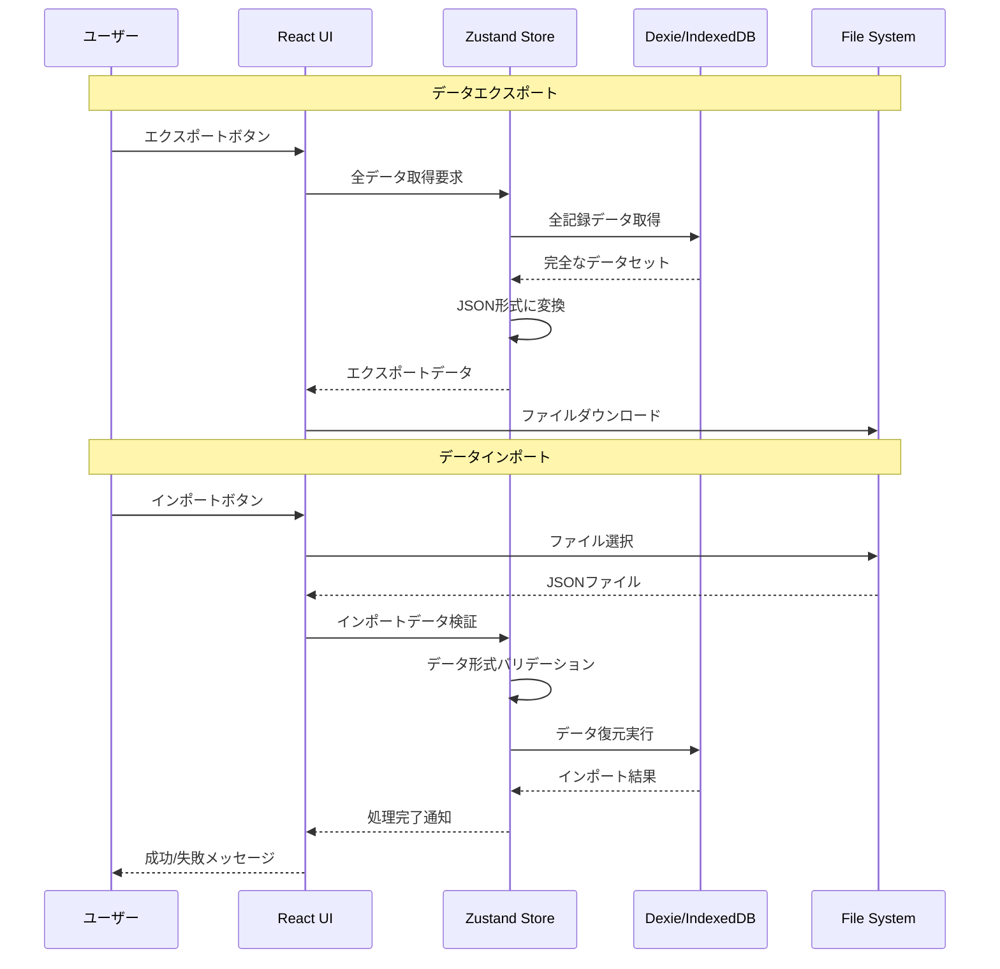

# データフロー図

## システム全体のデータフロー



## 釣果記録作成フロー



## 釣果一覧表示フロー



## 釣果詳細表示フロー



## データ永続化フロー



## 潮汐情報システムフロー（新規追加）

### 潮汐計算データフロー（改善版）



### 潮汐UI統合フロー

```mermaid
sequenceDiagram
    participant U as ユーザー
    participant R as 釣果記録詳細
    participant T as 潮汐システム
    participant C as キャッシュ
    participant G as グラフUI

    U->>R: 記録詳細表示
    R->>T: 潮汐情報リクエスト<br/>(GPS座標, 日時)
    T->>C: キャッシュ確認

    alt キャッシュヒット
        C-->>T: キャッシュデータ返却
        Note over T: 10ms以内
    else キャッシュミス
        T->>T: 天体計算実行
        Note over T: 200ms以内
        T->>C: 計算結果キャッシュ
    end

    T-->>R: HybridTideInfo返却
    R->>G: タイドグラフ描画
    G->>G: SVG生成・アニメーション
    G-->>U: インタラクティブグラフ表示

    U->>G: グラフ操作<br/>(ホバー・タップ)
    G-->>U: 詳細ツールチップ表示

### 潮汐グラフ改善フロー（新規）

```mermaid
sequenceDiagram
    participant U as ユーザー
    participant R as 釣果記録詳細
    participant T as TideCalculationService
    participant V as 変動係数エンジン
    participant G as TideGraph（改善版）
    participant C as キャッシュ

    U->>R: 異なる釣果記録を表示
    R->>T: 潮汐計算リクエスト<br/>(座標A, 日時A)

    T->>V: 座標変動係数計算
    V-->>T: 緯度・経度補正値
    T->>V: 季節変動係数計算
    V-->>T: 春分基準年間係数

    T->>T: 調和定数個別化<br/>M2×緯度係数×季節係数
    T->>T: K1・O1分潮生成

    T->>C: 座標・日時・変動ハッシュで<br/>キャッシュ保存
    T-->>R: 個別化TideInfo返却

    R->>G: レスポンシブグラフ描画
    G->>G: 画面幅検出
    G->>G: SVGビューボックス調整
    G->>G: 横スクロール防止CSS適用
    G-->>U: 座標・日時固有グラフ表示

    Note over U,G: 異なる座標・日時で<br/>異なるグラフパターン生成

    U->>R: 別の釣果記録を表示
    R->>T: 潮汐計算リクエスト<br/>(座標B, 日時B)

    Note over T,V: 同様の個別化処理
    T-->>R: 異なるTideInfo返却
    R->>G: 異なるグラフ描画
    G-->>U: 視覚的に区別可能な<br/>グラフパターン表示
```

## エラーハンドリングフロー



## データ同期・バックアップフロー

