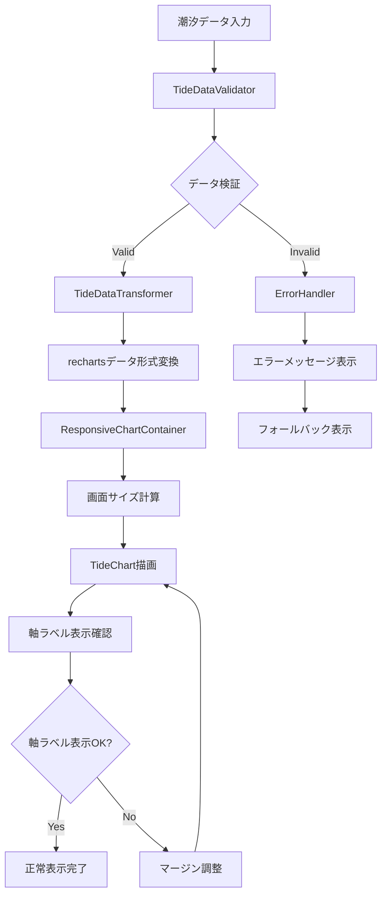
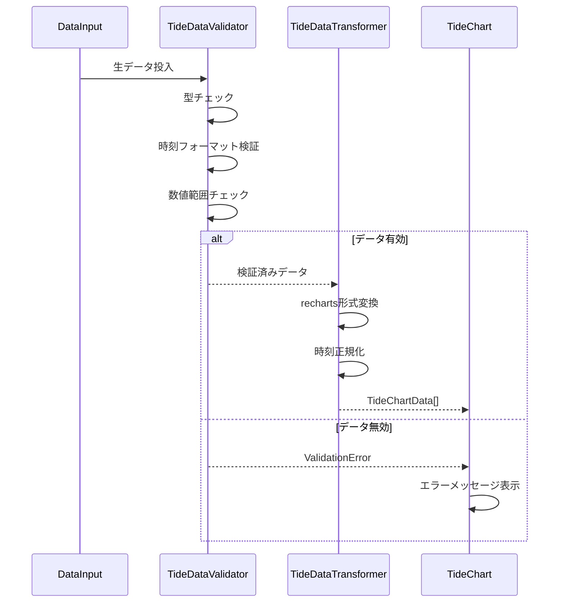
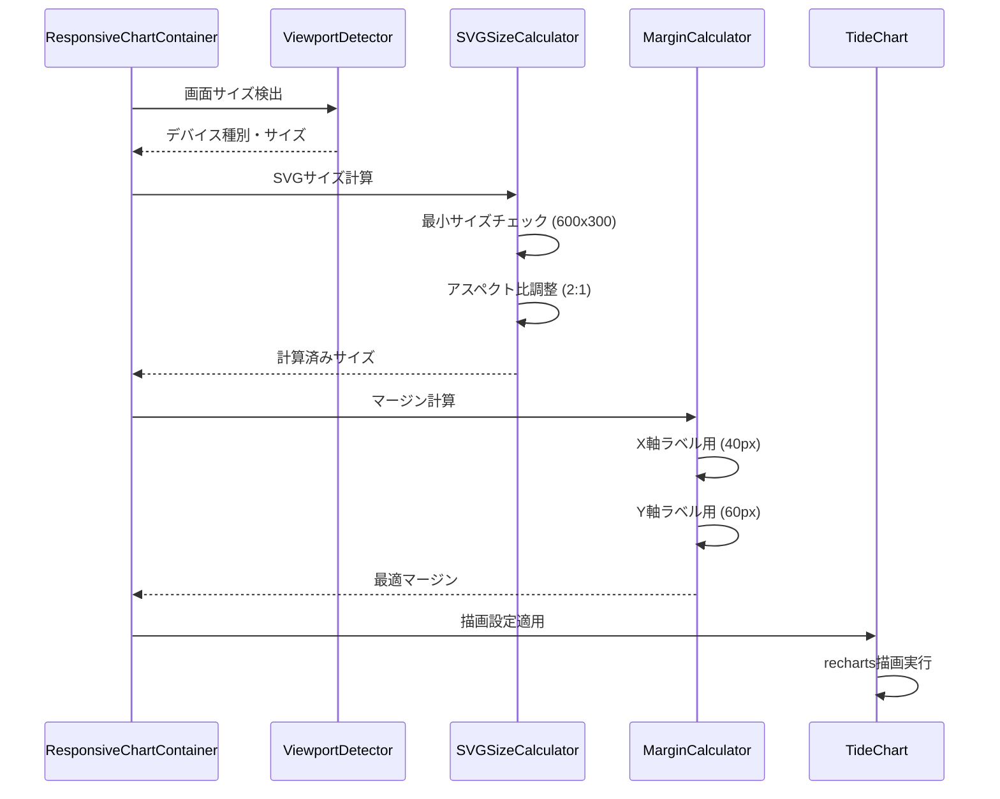
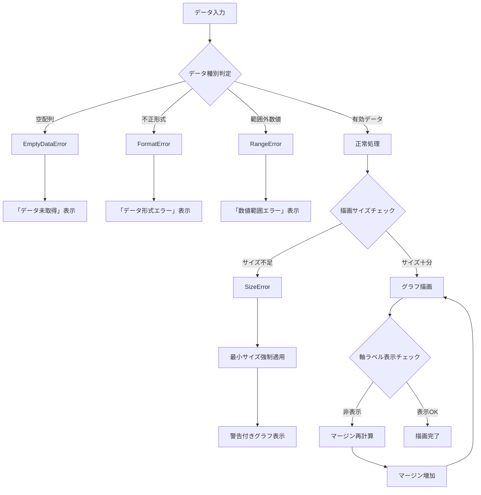
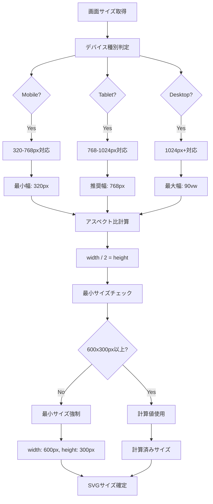
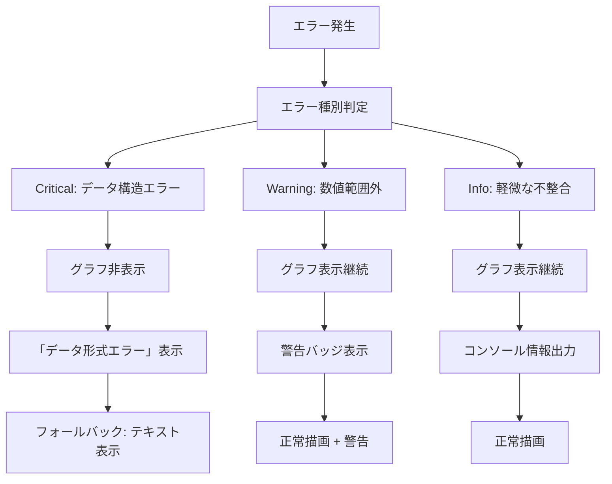
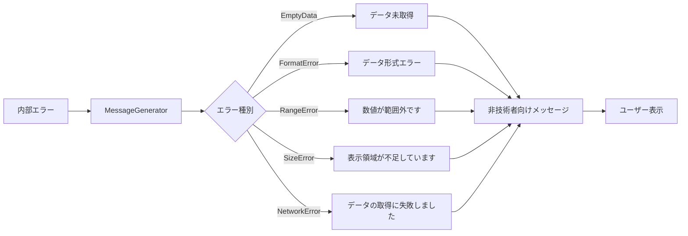
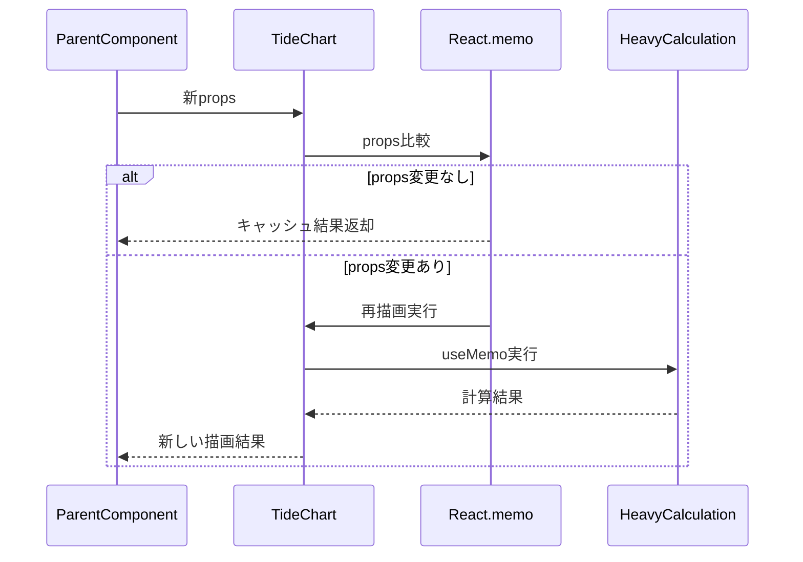
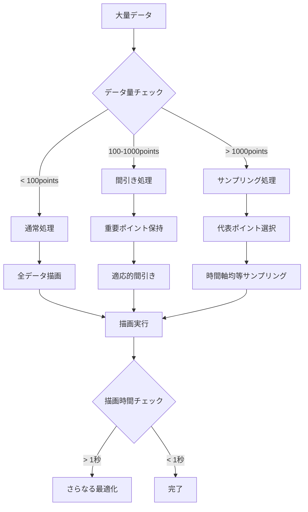

# TASK-303: 潮汐グラフ描画改善 データフロー図

## システム全体のデータフロー

### 高レベルデータフロー（描画改善）



## 詳細データフロー

### 1. データ検証・変換フロー



### 2. レスポンシブ描画フロー



### 3. エラーハンドリングフロー



## データ変換詳細フロー

### 内部データ → recharts形式変換

```mermaid
flowchart LR
    A[TideGraphPoint[]] --> B[DataTransformer]

    B --> C[時刻抽出]
    C --> D[Date → "HH:mm"]

    B --> E[潮位抽出]
    E --> F[number → cm単位]

    B --> G[イベント判定]
    G --> H[boolean → isEvent]

    D --> I[TideChartData]
    F --> I
    H --> I

    I --> J[rechartsLineChart]

    subgraph "変換例"
        K["{ time: Date('14:30'), level: 125.5, isEvent: true }"]
        L["{ time: '14:30', tide: 125.5, isEvent: true }"]
        K --> L
    end
```

### データ検証詳細フロー

```mermaid
flowchart TD
    A[入力データ] --> B[型チェック]
    B --> C{配列型?}
    C -->|No| D[TypeError]
    C -->|Yes| E[要素数チェック]

    E --> F{要素数 > 1?}
    F -->|No| G[EmptyDataError]
    F -->|Yes| H[各要素検証]

    H --> I[時刻フォーマット検証]
    I --> J[/^\d{2}:\d{2}$/]
    J --> K{正規表現一致?}
    K -->|No| L[TimeFormatError]
    K -->|Yes| M[数値検証]

    M --> N[typeof tide === 'number']
    N --> O{数値型?}
    O -->|No| P[NumberTypeError]
    O -->|Yes| Q[範囲チェック]

    Q --> R[-1000 <= tide <= 10000]
    R --> S{範囲内?}
    S -->|No| T[RangeError]
    S -->|Yes| U[検証完了]

    D --> V[エラーハンドリング]
    G --> V
    L --> V
    P --> V
    T --> V
    U --> W[正常処理]
```

## SVGサイズ計算フロー

### レスポンシブサイズ計算



### マージン動的計算

```mermaid
flowchart TD
    A[SVGサイズ] --> B[利用可能領域計算]
    B --> C[SVG幅 - 軸ラベル領域]

    C --> D[X軸マージン計算]
    D --> E[bottom: Math.max(40px, 高さ*0.15)]

    B --> F[Y軸マージン計算]
    F --> G[left: Math.max(60px, 幅*0.1)]

    E --> H[マージン確定]
    G --> H

    H --> I[チャート領域計算]
    I --> J[chartWidth = SVG幅 - left - right]
    I --> K[chartHeight = SVG高 - top - bottom]

    J --> L{チャート領域 > 最小サイズ?}
    K --> L
    L -->|No| M[マージン縮小]
    L -->|Yes| N[マージン確定]

    M --> O[マージン再計算]
    O --> I
    N --> P[描画実行]
```

## エラー分類・処理フロー

### エラー優先度分類



### ユーザーメッセージ生成



## パフォーマンス最適化フロー

### レンダリング最適化



### データ処理最適化



---

**作成日**: 2025-09-28
**作成者**: フロントエンド開発チーム