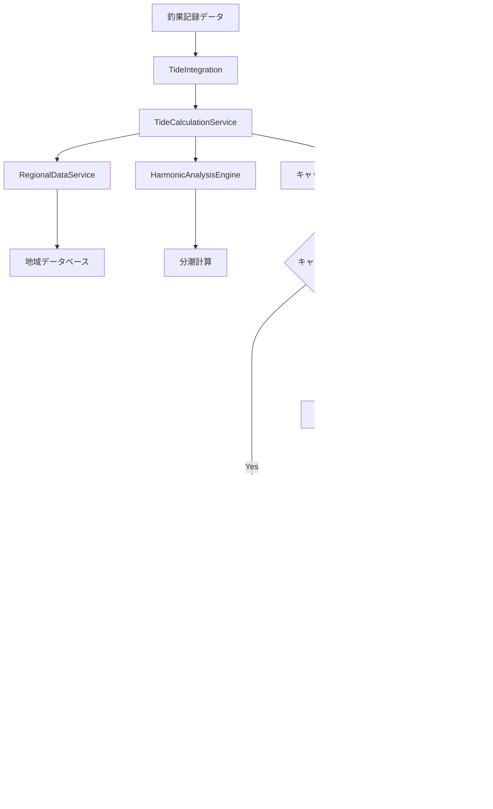

# 潮汐グラフ改善 データフロー図

## システム全体のデータフロー

### 高レベルデータフロー

## 詳細データフロー

### 1. 潮汐計算初期化フロー

### 2. グラフ描画フロー

### 3. レスポンシブ対応フロー

## データ変換フロー

### 座標・日時から潮汐データへの変換

### グラフデータ構造変換

## エラーハンドリングフロー

### 座標エラー処理

### グラフ描画エラー処理

## パフォーマンス最適化フロー

### キャッシュ戦略

### レンダリング最適化

---

**作成日**: 2025-09-28
**作成者**: 潮汐システム開発チーム