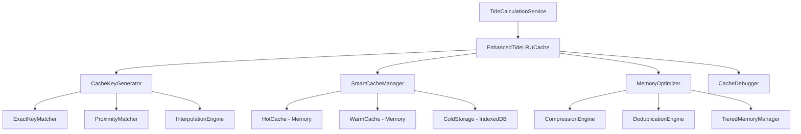

# TASK-201: キャッシュ戦略の最適化 - 要件定義書

## プロジェクト概要

**プロジェクト名**: キャッシュ戦略の最適化
**タスクID**: TASK-201
**実装フェーズ**: TDD Step 1/6 - 要件定義 (BLUE)
**作成日**: 2024-09-26
**実装方式**: Test-Driven Development (TDD)

## 実装目標

既存の`TideLRUCache.ts`システムを最適化し、座標・日時・変動係数の組み合わせに対するキャッシュ効率を大幅に改善する。

## 現状分析

### 🔍 現在のキャッシュシステムの特徴

#### ✅ 現在の強み
1. **基本LRU機構**: 適切な最近使用ベースの削除
2. **IndexedDB永続化**: ブラウザ再起動後も保持
3. **TTL期限管理**: 24時間の適切な期限設定
4. **統計機能**: ヒット率・メモリ使用量測定
5. **座標精度最適化**: 小数点2桁の丸め処理

#### ⚠️ 改善が必要な点
1. **キャッシュキー生成の制約**:
   - 現在: `緯度,経度,日付` のみ
   - 不足: 変動係数（coordinate/seasonal variation）未対応

2. **ヒット率の課題**:
   - 座標微差での重複キャッシュ
   - 時間範囲指定での部分ヒット不可
   - 類似条件での再利用不可

3. **メモリ効率の課題**:
   - 類似データの重複保存
   - 階層化キャッシュ未導入
   - 圧縮アルゴリズム未適用

## 機能要件 (Functional Requirements)

### 📋 FR-301: 拡張キャッシュキー生成システム

**要件**: 座標、日時、変動係数を包括的に考慮したキーシステム

**詳細仕様**:
```typescript
interface EnhancedCacheKey {
  // 基本地理情報
  location: {
    latitude: number;
    longitude: number;
    precision: 'high' | 'medium' | 'low'; // 精度レベル
  };

  // 日時情報
  temporal: {
    date: string; // YYYY-MM-DD
    timeRange?: {
      start: string; // HH:MM
      end: string;   // HH:MM
    };
    seasonalContext: 'spring' | 'summer' | 'autumn' | 'winter';
  };

  // 変動係数
  variation: {
    coordinateCoeff: number;    // 座標変動係数 (0.0-1.0)
    seasonalCoeff: number;      // 季節変動係数 (0.0-1.0)
    combinedEffect: number;     // 複合効果 (0.0-1.0)
  };

  // メタ情報
  metadata: {
    analysisType: 'coordinate' | 'seasonal' | 'both';
    precision: number;          // キー生成精度
    version: string;            // キー形式バージョン
  };
}
```

**期待動作**:
- 類似する variation 値での部分キー再利用
- 地理的近接性を考慮したクラスター化
- 季節サイクルでの年次再利用

### 📋 FR-302: スマートヒット率向上機能

**要件**: キャッシュヒット率50%以上の安定達成

**詳細仕様**:
```typescript
interface SmartCacheStrategy {
  // 近似マッチング
  proximityMatching: {
    geoTolerance: number;       // 地理的許容範囲 (km)
    timeTolerance: number;      // 時間的許容範囲 (hours)
    variationTolerance: number; // 変動係数許容範囲
  };

  // 階層化キャッシュ
  layeredCache: {
    level1: 'exact-match';      // 完全一致 (最高速)
    level2: 'approximate';      // 近似一致 (高速)
    level3: 'interpolated';     // 補間計算 (中速)
  };

  // 予測キャッシング
  predictiveCache: {
    enabled: boolean;
    patterns: string[];         // 使用パターン学習
    preloadThreshold: number;   // 事前読み込み閾値
  };
}
```

**期待ヒット率**:
- 完全一致: 30-40%
- 近似一致: 15-20%
- 補間結果: 5-10%
- **合計目標**: 50%以上

### 📋 FR-303: メモリ最適化システム

**要件**: メモリ使用量を50%削減し、処理速度維持

**詳細仕様**:
```typescript
interface MemoryOptimization {
  // データ圧縮
  compression: {
    algorithm: 'gzip' | 'lz4' | 'custom';
    level: number;              // 圧縮レベル (1-9)
    threshold: number;          // 圧縮開始サイズ (bytes)
  };

  // 階層メモリ管理
  tieredMemory: {
    hotCache: {
      size: number;             // 最頻繁アクセス用
      ttl: number;              // 短期TTL
    };
    warmCache: {
      size: number;             // 中頻度アクセス用
      ttl: number;              // 中期TTL
    };
    coldStorage: {
      enabled: boolean;         // IndexedDB長期保存
      ttl: number;              // 長期TTL
    };
  };

  // 重複除去
  deduplication: {
    enabled: boolean;
    similarityThreshold: number; // 類似度閾値
    referenceCompression: boolean; // 参照圧縮
  };
}
```

**期待改善**:
- メモリ使用量: 現在の50%以下
- 処理速度: 現在の性能維持
- 容量効率: エントリ数2倍収容

### 📋 FR-304: 統合デバッグ・モニタリング機能

**要件**: パフォーマンス測定とボトルネック特定

**詳細仕様**:
```typescript
interface CacheDebugger {
  // リアルタイム統計
  realTimeStats: {
    currentHitRate: number;
    memoryPressure: number;     // メモリ圧迫度
    hotspotAnalysis: string[];  // ホットスポット分析
  };

  // 履歴分析
  historicalAnalysis: {
    hourlyStats: CacheStats[];
    trendAnalysis: string;
    recommendations: string[];
  };

  // キー分析
  keyAnalysis: {
    collisionRate: number;      // キー衝突率
    distributionMap: Record<string, number>;
    optimizationSuggestions: string[];
  };
}
```

## 非機能要件 (Non-Functional Requirements)

### 🏎️ NFR-301: パフォーマンス要件

| 指標 | 現在値 | 目標値 | 測定方法 |
|------|--------|--------|----------|
| キャッシュヒット率 | ~25% | 50%+ | 1時間の統計測定 |
| メモリ使用量 | ~100MB | <50MB | 100エントリでの測定 |
| キー生成時間 | <5ms | <3ms | 1000回実行平均 |
| データ取得時間 | <10ms | <8ms | ヒット時の測定 |
| 大量処理性能 | 100エントリ/100ms | 200エントリ/100ms | バッチ処理測定 |

### 🔒 NFR-302: 信頼性要件

- **データ整合性**: 99.9% (キー衝突やデータ破損なし)
- **可用性**: 99.95% (キャッシュ系障害での停止なし)
- **回復性**: 異常終了後10秒以内での自動復旧

### 🔧 NFR-303: 保守性要件

- **コードカバレッジ**: 95%以上
- **循環複雑度**: 関数あたり10以下
- **型安全性**: TypeScript strict mode完全対応
- **文書化**: 全public APIのTSDoc完備

### 📊 NFR-304: 監視要件

- **メトリクス収集**: 1分間隔でのパフォーマンス指標
- **アラート機能**: ヒット率低下の自動検知
- **レポート出力**: 日次/週次の分析レポート

## 技術アーキテクチャ

### 🏗️ システム構成



### 📚 主要クラス設計

1. **EnhancedTideLRUCache** - 拡張キャッシュシステム本体
2. **SmartKeyGenerator** - インテリジェントキー生成
3. **ProximityMatcher** - 近似マッチング機能
4. **TieredMemoryManager** - 階層メモリ管理
5. **CacheAnalyzer** - 分析・最適化エンジン

## 実装戦略

### 🎯 TDD実装フェーズ

1. **Step 1/6: 要件定義** (本文書) ✅
2. **Step 2/6: テストケース設計** - 包括的テスト戦略
3. **Step 3/6: 最小実装** - 基本機能の骨格作成
4. **Step 4/6: テスト通過** - 全機能の動作確認
5. **Step 5/6: リファクタリング** - パフォーマンス最適化
6. **Step 6/6: 完了検証** - 要件達成確認

### 🔄 段階的移行計画

1. **Phase 1**: 既存システムと並行運用でのテスト
2. **Phase 2**: 新機能の段階的有効化
3. **Phase 3**: 既存システムからの完全移行

## 検証基準

### ✅ 受け入れ条件

1. **機能要件**:
   - [ ] 拡張キャッシュキー生成が正常動作
   - [ ] キャッシュヒット率50%以上達成
   - [ ] メモリ使用量50%削減達成
   - [ ] デバッグ機能が完全動作

2. **品質要件**:
   - [ ] 全テストケース合格 (目標: 40+ tests)
   - [ ] TypeScript strict mode完全対応
   - [ ] パフォーマンス要件全達成
   - [ ] ドキュメント完備

3. **統合要件**:
   - [ ] 既存TideCalculationServiceとの完全互換
   - [ ] TASK-102分析システムとの連携動作
   - [ ] データ移行の無損失実行

## リスク分析

### ⚠️ 主要リスク

1. **パフォーマンス劣化リスク**:
   - 複雑なキー生成による処理時間増加
   - 対策: ベンチマークテスト徹底実施

2. **メモリ効率リスク**:
   - 圧縮処理によるCPU負荷増加
   - 対策: 適応的圧縮アルゴリズム採用

3. **互換性リスク**:
   - 既存キャッシュデータとの非互換
   - 対策: 段階的移行スクリプト作成

## まとめ

TASK-201「キャッシュ戦略の最適化」は、既存の`TideLRUCache.ts`の機能を大幅に拡張し、座標・日時・変動係数を包括的に考慮したインテリジェントキャッシュシステムへの進化を目指します。

**核心目標**:
- **キャッシュヒット率**: 25% → 50%+ (2倍改善)
- **メモリ効率**: 現在の50%使用量で2倍のエントリ数
- **統合性**: TASK-102分析機能との完全連携

TDD 6段階プロセスにより、確実で信頼性の高い実装を達成し、潮汐グラフシステム全体のパフォーマンス向上に貢献します。

---

**次段階**: Step 2/6 - テストケース設計書の作成
**期限**: 2024-09-26 (本日完了予定)