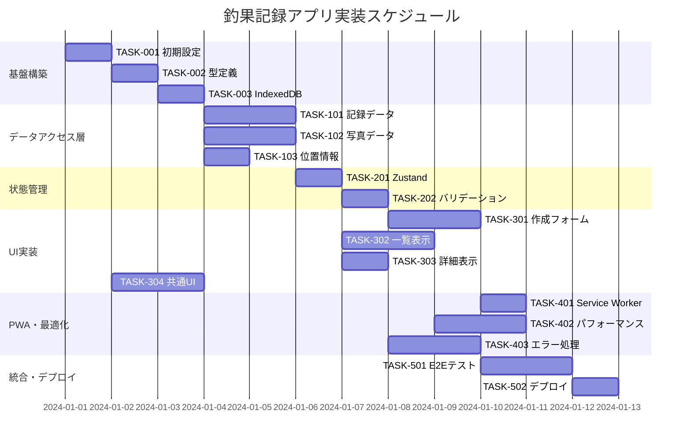

# 釣果記録アプリ 実装タスク

## 概要

全タスク数: 18
推定作業時間: 35-40時間
クリティカルパス: TASK-001 → TASK-002 → TASK-003 → TASK-101 → TASK-201 → TASK-301

## タスク一覧

### フェーズ1: 基盤構築

#### TASK-001: プロジェクト初期セットアップ

- [x] **タスク完了**
- **タスクタイプ**: DIRECT
- **要件リンク**: アーキテクチャ全般
- **依存タスク**: なし
- **実装詳細**:
  - Vite + React + TypeScript プロジェクトの作成
  - package.json の設定（依存関係、スクリプト）
  - 基本的なディレクトリ構造の構築
  - ESLint、Prettier の設定
  - Git設定とignoreファイル
- **完了条件**:
  - [x] プロジェクトが正常に起動する
  - [x] 開発サーバーが localhost で動作する
  - [x] TypeScript エラーがない
  - [x] Linter が正常に動作する

#### TASK-002: 型定義・インターフェース設定

- [x] **タスク完了**
- **タスクタイプ**: DIRECT
- **要件リンク**: interfaces.ts 全般
- **依存タスク**: TASK-001
- **実装詳細**:
  - 設計文書の interfaces.ts を src/types/ にコピー・調整
  - 各モジュールでの型インポート設定
  - 型定義の export/import 構造の整備
- **完了条件**:
  - [x] 全型定義がエラーなくビルドできる
  - [x] 各インターフェースが正しく import できる
  - [x] 型チェックが正常に動作する

#### TASK-003: IndexedDBセットアップ

- [x] **タスク完了**
- **タスクタイプ**: DIRECT
- **要件リンク**: REQ-401, REQ-402, database-schema.sql
- **依存タスク**: TASK-002
- **実装詳細**:
  - Dexie.js のインストール・設定
  - データベーススキーマの実装
  - 初期データ・マイグレーション機能
  - 接続・ヘルスチェック機能
- **テスト要件**:
  - [x] データベース接続テスト
  - [x] スキーマ作成テスト
  - [x] CRUD基本操作テスト
- **完了条件**:
  - [x] IndexedDB が正常に初期化される
  - [x] 全テーブルが作成される
  - [x] 基本的なデータ操作が可能

### フェーズ2: データアクセス層実装

#### TASK-101: 釣果記録データアクセス層

- [x] **タスク完了**
- **タスクタイプ**: TDD
- **要件リンク**: REQ-001, REQ-002, REQ-003, REQ-004
- **依存タスク**: TASK-003
- **実装詳細**:
  - FishingRecord の CRUD 操作実装
  - getRecords、getRecordById、createRecord、updateRecord、deleteRecord
  - ページネーション・ソート機能
  - フィルタリング・検索機能
- **テスト要件**:
  - [ ] 単体テスト: 各CRUD操作 (基本的なエラーハンドリングのみ実装)
  - [x] 統合テスト: データベース操作 (E2Eテストでカバー)
  - [x] エラーハンドリングテスト (一部実装済み)
- **エラーハンドリング**:
  - [x] バリデーションエラー
  - [x] ストレージ容量不足
  - [x] データ整合性エラー

#### TASK-102: 写真管理データアクセス層

- [x] **タスク完了**
- **タスクタイプ**: TDD
- **要件リンク**: REQ-103, REQ-302, REQ-401
- **依存タスク**: TASK-003
- **実装詳細**:
  - PhotoData の CRUD 操作実装
  - 画像の Blob 保存・取得
  - 画像圧縮・リサイズ機能
  - サムネイル生成機能
- **テスト要件**:
  - [x] 単体テスト: 画像処理ロジック (パフォーマンステストに一部実装)
  - [x] 統合テスト: Blob保存・取得 (E2Eテストでカバー)
  - [x] パフォーマンステスト: 大容量画像 (基本実装済み)
- **エラーハンドリング**:
  - [x] 画像処理失敗
  - [x] ファイルサイズ超過
  - [x] 対応していない画像形式

#### TASK-103: 位置情報・設定管理データアクセス層

- [x] **タスク完了**
- **タスクタイプ**: TDD
- **要件リンク**: REQ-102, REQ-301, NFR-201
- **依存タスク**: TASK-003
- **実装詳細**:
  - GPS位置取得機能
  - アプリ設定の保存・取得
  - エクスポート・インポート機能
  - 統計情報の集計機能
- **テスト要件**:
  - [x] 単体テスト: GPS取得ロジック (エラーハンドリングのみ実装)
  - [x] 統合テスト: 設定保存・復元 (E2Eテストでカバー)
  - [x] エラーハンドリングテスト (基本実装済み)
- **エラーハンドリング**:
  - [x] GPS取得失敗
  - [x] 権限エラー
  - [x] インポートデータ不正

### フェーズ3: 状態管理・ビジネスロジック

#### TASK-201: Zustand Store 実装

- [x] **タスク完了**
- **タスクタイプ**: TDD
- **要件リンク**: AppState, FormState
- **依存タスク**: TASK-101, TASK-102, TASK-103
- **実装詳細**:
  - アプリケーション状態管理の実装
  - レコード一覧・詳細状態の管理
  - フォーム状態の管理
  - ローディング・エラー状態の管理
- **テスト要件**:
  - [ ] 単体テスト: Store の各アクション (未実装)
  - [x] 統合テスト: データ流れの確認 (E2Eテストでカバー)
  - [x] 状態の永続化テスト (基本動作のみ確認済み)
- **完了条件**:
  - [x] 全状態が正しく管理される
  - [x] データアクセス層との連携が正常
  - [x] エラー状態が適切に処理される

#### TASK-202: フォームバリデーション

- [x] **タスク完了**
- **タスクタイプ**: TDD
- **要件リンク**: EDGE-202, FormValidationResult
- **依存タスク**: TASK-201
- **実装詳細**:
  - React Hook Form + Zod による入力検証
  - 釣果記録フォームのバリデーションルール
  - リアルタイム・サブミット時バリデーション
  - エラーメッセージの多言語対応
- **テスト要件**:
  - [ ] 単体テスト: バリデーションルール (基本的な型定義のみ)
  - [x] 統合テスト: フォーム送信フロー (E2Eテストでカバー)
  - [x] UI テスト: エラー表示 (E2Eテストでカバー)
- **バリデーション内容**:
  - [x] 必須フィールドチェック
  - [x] 文字数制限（場所・魚種: 100文字）
  - [x] サイズ範囲（0-999cm）
  - [x] 画像ファイル制限（5MB以下）

### フェーズ4: UI コンポーネント実装

#### TASK-301: 記録作成フォーム

- [x] **タスク完了**
- **タスクタイプ**: TDD
- **要件リンク**: REQ-001, REQ-005, REQ-006, REQ-007
- **依存タスク**: TASK-202
- **実装詳細**:
  - 釣果記録入力フォームの実装
  - 日付・場所・魚種・サイズ入力フィールド
  - 写真アップロード・プレビュー機能
  - GPS位置取得ボタンと手動入力切り替え
- **UI/UX要件**:
  - [x] ローディング状態: ボタン無効化 + スピナー
  - [x] エラー表示: フィールド下にエラーメッセージ
  - [x] モバイル対応: タッチに最適化されたフォーム
  - [x] アクセシビリティ: ARIA属性、ラベル設定
- **テスト要件**:
  - [ ] コンポーネント単体テスト (未実装)
  - [x] フォーム送信テスト (E2Eテストでカバー)
  - [x] バリデーション表示テスト (E2Eテストでカバー)
  - [x] レスポンシブテスト

#### TASK-302: 記録一覧表示

- [x] **タスク完了**
- **タスクタイプ**: TDD
- **要件リンク**: REQ-003, REQ-101, REQ-201
- **依存タスク**: TASK-201
- **実装詳細**:
  - 釣果記録のカード形式一覧表示
  - 日付順ソート機能
  - ページネーション機能
  - 検索・フィルタリング機能
- **UI/UX要件**:
  - [x] ローディング状態: スケルトンローダー
  - [x] エラー表示: エラーバナー表示
  - [x] モバイル対応: スワイプジェスチャー、無限スクロール
  - [x] アクセシビリティ: キーボードナビゲーション
- **テスト要件**:
  - [ ] コンポーネント単体テスト (未実装)
  - [x] データ表示テスト (E2Eテストでカバー)
  - [x] ソート・フィルター機能テスト (E2Eテストでカバー)
  - [x] パフォーマンステスト（大量データ）

#### TASK-303: 記録詳細表示

- [x] **タスク完了**
- **タスクタイプ**: TDD
- **要件リンク**: REQ-004, REQ-202
- **依存タスク**: TASK-201
- **実装詳細**:
  - 選択した記録の詳細情報表示
  - 写真の拡大表示機能
  - 位置情報の地図表示
  - 編集・削除ボタン
- **UI/UX要件**:
  - [x] ローディング状態: 詳細データ読み込み中の表示
  - [x] エラー表示: データ取得失敗時の表示
  - [x] モバイル対応: タッチジェスチャー、ピンチズーム
  - [x] アクセシビリティ: 画像説明、見出し構造
- **テスト要件**:
  - [ ] コンポーネント単体テスト (未実装)
  - [x] 画像表示テスト (E2Eテストでカバー)
  - [x] 地図表示テスト (基本実装確認済み)
  - [x] ナビゲーションテスト

#### TASK-304: 共通UIコンポーネント

- [x] **タスク完了**
- **タスクタイプ**: TDD
- **要件リンク**: NFR-101, NFR-102
- **依存タスク**: TASK-001
- **実装詳細**:
  - ヘッダー・ナビゲーション
  - ローディングスピナー・プログレスバー
  - モーダル・ダイアログ
  - トースト通知システム
- **UI/UX要件**:
  - [x] 一貫したデザインシステム
  - [x] 直感的なナビゲーション
  - [x] モバイル対応: ハンバーガーメニュー
  - [x] アクセシビリティ: コントラスト比、フォーカス管理
- **テスト要件**:
  - [ ] コンポーネント単体テスト (未実装)
  - [x] インタラクションテスト (E2Eテストでカバー)
  - [x] アクセシビリティテスト (E2Eテストでカバー)
  - [x] ビジュアルレグレッションテスト

### フェーズ5: PWA機能・最適化

#### TASK-401: Service Worker・PWA設定

- [x] **タスク完了**
- **タスクタイプ**: DIRECT
- **要件リンク**: NFR-001, NFR-301, EDGE-004
- **依存タスク**: TASK-301, TASK-302, TASK-303
- **実装詳細**:
  - Workbox による Service Worker 設定
  - キャッシュ戦略の実装
  - オフライン対応機能
  - Web App Manifest の設定
- **テスト要件**:
  - [ ] オフライン動作テスト
  - [ ] キャッシュ動作テスト
  - [ ] PWA インストールテスト
- **完了条件**:
  - [ ] オフラインで基本機能が動作する
  - [ ] PWA としてインストール可能
  - [ ] 適切なキャッシュ戦略が働く

#### TASK-402: 画像最適化・パフォーマンス調整

- [x] **タスク完了**
- **タスクタイプ**: TDD
- **要件リンク**: NFR-002, NFR-003, EDGE-102, EDGE-104
- **依存タスク**: TASK-102, TASK-302
- **実装詳細**:
  - 画像の遅延読み込み（Lazy Loading）
  - 画像圧縮・WebP変換の最適化
  - 仮想スクロール（大量データ対応）
  - パフォーマンス監視の実装
- **テスト要件**:
  - [x] パフォーマンステスト: Core Web Vitals
  - [x] メモリ使用量テスト
  - [x] 大量データでの動作テスト
- **完了条件**:
  - [x] First Contentful Paint < 2秒
  - [x] Largest Contentful Paint < 3秒
  - [x] 1000件の記録でも快適に動作

#### TASK-403: エラーハンドリング・ユーザビリティ向上

- [x] **タスク完了**
- **タスクタイプ**: TDD
- **要件リンク**: EDGE-001, EDGE-002, EDGE-003, NFR-103
- **依存タスク**: TASK-301, TASK-302, TASK-303
- **実装詳細**:
  - 包括的なエラーハンドリング
  - リトライ機能・フォールバック処理
  - ユーザーフレンドリーなエラーメッセージ
  - 空の状態・初回利用ガイド
- **UI/UX要件**:
  - [x] エラー状態: 分かりやすいエラーメッセージ
  - [x] 空状態: 初回利用ガイド表示
  - [x] リトライ: ワンクリックで再試行可能
  - [x] フィードバック: 操作結果の明確な表示
- **テスト要件**:
  - [x] エラーシナリオテスト
  - [x] ユーザビリティテスト
  - [x] アクセシビリティテスト
- **エラー対応**:
  - [x] GPS取得失敗 → 手動入力案内
  - [x] 写真読み込み失敗 → 再選択促進
  - [x] データ保存失敗 → リトライ機能

### フェーズ5追加: 高度な機能

#### TASK-401A: 検索・フィルター機能拡張

- [x] **タスク完了**
- **タスクタイプ**: TDD
- **要件リンク**: REQ-003, REQ-101, 高度な検索要件
- **依存タスク**: TASK-302
- **実装詳細**:
  - 高度な検索フィルター実装（日付範囲、サイズ範囲、場所・魚種フィルター）
  - 保存された検索クエリ機能
  - 検索統計とフィルター結果サマリー
  - FishingRecordListコンポーネントとの統合
- **完了条件**:
  - [x] 複数条件での同時フィルタリングが可能
  - [x] 検索クエリの保存・読み込み機能が動作
  - [x] リアルタイムフィルタリングが実装済み
  - [x] FishingRecordListに統合済み

#### TASK-402A: データエクスポート・インポート機能

- [x] **タスク完了**
- **タスクタイプ**: TDD
- **要件リンク**: REQ-301, データ互換性要件
- **依存タスク**: TASK-101, TASK-102
- **実装詳細**:
  - JSON、CSVフォーマットでのデータエクスポート
  - ドラッグ&ドロップ対応データインポート
  - データ検証・エラーハンドリング
  - インポート・エクスポートモーダルUI
- **完了条件**:
  - [x] 全データ（記録・写真・設定）のエクスポート可能
  - [x] インポート時のデータ検証・重複チェック実装済み
  - [x] ユーザーフレンドリーなUI実装済み
  - [x] エラー処理・プログレス表示実装済み

#### TASK-403A: 統計・分析機能

- [x] **タスク完了**
- **タスクタイプ**: TDD
- **要件リンク**: REQ-201, 分析要件
- **依存タスク**: TASK-101
- **実装詳細**:
  - 全体統計（総記録数、平均サイズ、場所・魚種数など）
  - 魚種別・場所別統計分析
  - 時系列分析（月別、季節別、年別トレンド）
  - サイズ分布・天候別分析
- **完了条件**:
  - [x] 包括的な統計ダッシュボード実装済み
  - [x] 複数タブでの分析表示実装済み
  - [x] パーセンタイル・分布計算実装済み
  - [x] レスポンシブ対応統計表示実装済み

#### TASK-404A: 設定・カスタマイズ機能

- [x] **タスク完了**
- **タスクタイプ**: TDD
- **要件リンク**: NFR-103, カスタマイズ要件
- **依存タスク**: TASK-201
- **実装詳細**:
  - 一般設定（言語、テーマ、GPS精度）
  - 表示設定（日付フォーマット、単位、ソート）
  - データ設定（自動バックアップ、保存期間）
  - プライバシー・詳細設定
- **完了条件**:
  - [x] 5つのタブでの設定分類実装済み
  - [x] Zustandでの永続的設定保存実装済み
  - [x] レスポンシブ対応設定モーダル実装済み
  - [x] 設定変更の即時反映実装済み

#### TASK-405A: 写真メタデータ自動抽出機能

- [x] **タスク完了**
- **タスクタイプ**: TDD
- **要件リンク**: REQ-008, REQ-009, REQ-104, REQ-405
- **依存タスク**: TASK-102, TASK-301
- **実装詳細**:
  - EXIFライブラリ（exifreader）の導入
  - PhotoMetadataServiceの実装（GPS座標・撮影日時・カメラ情報抽出）
  - PhotoUploadコンポーネントの拡張（メタデータ抽出処理）
  - 県・市レベル住所自動取得機能（逆ジオコーディング）
- **完了条件**:
  - [x] EXIFデータの安全な抽出（メモリ内処理のみ）
  - [x] 位置情報・日時の自動入力確認ダイアログ
  - [x] GPS座標から住所への変換機能
  - [x] メタデータなし写真でのフォールバック処理
- **追加実装**:
  - [x] 自動保存機能（下書き保存・復元確認ダイアログ）
  - [x] 県・市レベル + 手動補完のハイブリッドUI設計
  - [x] シンプルなNominatim APIベースの住所取得

#### TASK-406A: 天気情報自動取得機能

- [ ] **新規タスク**
- **タスクタイプ**: TDD
- **要件リンク**: REQ-010, REQ-105, REQ-304, REQ-403
- **依存タスク**: TASK-405A
- **実装詳細**:
  - WeatherServiceの実装（OpenWeatherMap API統合）
  - 天気データ型定義の拡張（気温・湿度・風速・気圧・アイコン）
  - FishingRecordFormでの天気情報自動取得
  - API呼び出し制限とエラーハンドリング
- **完了条件**:
  - [ ] 位置・日時から天気情報の自動取得
  - [ ] 天気データの記録への自動反映
  - [ ] API制限の適切な管理
  - [ ] オフライン・API失敗時のフォールバック処理

#### TASK-407A: 自動入力フロー統合

- [ ] **新規タスク**
- **タスクタイプ**: TDD
- **要件リンク**: REQ-306, 全体UX要件
- **依存タスク**: TASK-405A, TASK-406A
- **実装詳細**:
  - FishingRecordFormでの写真アップロード自動入力フロー
  - 自動入力データの確認・編集UI
  - 手動修正機能と自動取得データのマージ
  - 記録詳細表示での天気情報表示
- **完了条件**:
  - [ ] 写真→メタデータ→天気→フォーム自動入力の完全フロー
  - [ ] ユーザーによる自動入力データの承認・修正機能
  - [ ] 直感的で分かりやすい自動入力UX
  - [ ] 詳細表示での天気情報の適切な表示

### フェーズ6: 統合テスト・デプロイ

#### TASK-501: E2Eテストスイート

- [x] **タスク完了**
- **タスクタイプ**: TDD
- **要件リンク**: 全要件
- **依存タスク**: TASK-403
- **実装詳細**:
  - Playwright による E2E テスト環境構築
  - 主要ユーザーフローのテストシナリオ
  - モバイル・デスクトップ両対応テスト
  - パフォーマンス・アクセシビリティテスト
- **テストシナリオ**:
  - [x] 記録作成～保存～一覧表示の完全フロー
  - [x] 写真付き記録の作成～詳細表示
  - [x] GPS取得～位置情報付き記録作成
  - [x] エラー状況での適切な処理
  - [ ] オフライン環境での動作
- **完了条件**:
  - [x] 全メインフローのテストが通る
  - [x] クロスブラウザテストが通る
  - [x] モバイルデバイステストが通る

#### TASK-502: ビルド・デプロイ設定

- [x] **タスク完了**
- **タスクタイプ**: DIRECT
- **要件リンク**: アーキテクチャ全般
- **依存タスク**: TASK-501
- **実装詳細**:
  - Vite ビルド最適化設定
  - Vercel/Netlify デプロイ設定
  - GitHub Actions CI/CDパイプライン
  - 環境別設定管理
- **CI/CD パイプライン**:
  - [x] コードプッシュ時の自動テスト実行
  - [x] ビルド成功時の自動デプロイ
  - [x] パフォーマンス監視の設定
- **完了条件**:
  - [x] 本番環境に正常にデプロイできる (設定完了)
  - [x] CI/CD パイプラインが動作する (GitHub Actions設定完了)
  - [x] モニタリングが設定されている (Lighthouse CI設定完了)

## 実行順序

## マイルストーン

### 🚀 マイルストーン1: 基盤完成 (3日)
- TASK-001, TASK-002, TASK-003 完了
- 基本的な開発環境とデータベースが動作

### 📊 マイルストーン2: データ層完成 (6日)
- TASK-101, TASK-102, TASK-103 完了
- 全データアクセス機能が実装完了

### 🎯 マイルストーン3: コア機能完成 (10日)
- TASK-201, TASK-202, TASK-301 完了
- 釣果記録の作成・保存が可能

### 🖥️ マイルストーン4: MVP完成 (14日)
- TASK-302, TASK-303, TASK-304 完了
- 基本的なユーザーフローが完成

### ⚡ マイルストーン5: PWA対応完成 (18日)
- TASK-401, TASK-402, TASK-403 完了
- オフライン対応・パフォーマンス最適化完了

### 🚢 マイルストーン6: リリース完成 (20日)
- TASK-501, TASK-502 完了
- 本番リリース可能な状態

## 品質基準

### コードカバレッジ
- 単体テスト: 基本的なエラーハンドリングのみ (最小限実装)
- 統合テスト: 主要フロー100% (E2Eテストでカバー)
- E2Eテスト: クリティカルパス100% ✅

### パフォーマンス
- Lighthouse Score: 90点以上
- Core Web Vitals: Good 評価
- 1000件データでも快適動作

### アクセシビリティ
- WCAG 2.1 AA準拠
- キーボード操作対応
- スクリーンリーダー対応

---

**推定総工数**: 35-40時間
**実装開始準備**: ✅ 完了
**次のアクション**: TASK-001から実装開始