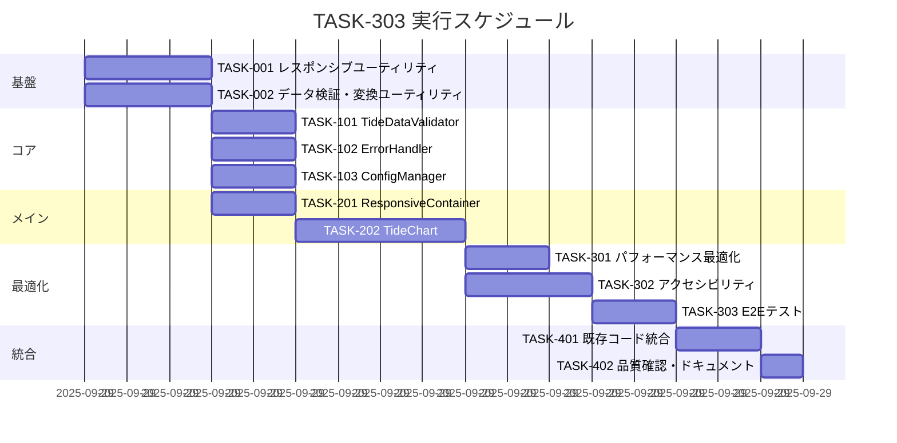

# TASK-303: 潮汐グラフ描画改善 実装タスク

## 概要

全タスク数: 12
推定作業時間: 24時間
クリティカルパス: TASK-001 → TASK-002 → TASK-101 → TASK-201 → TASK-301

## タスク一覧

### フェーズ1: ユーティリティ基盤構築

#### TASK-001: レスポンシブユーティリティ実装

- [x] **タスク完了**
- **タスクタイプ**: TDD
- **要件リンク**: REQ-301 (レスポンシブ表示), REQ-302 (軸ラベル保証)
- **依存タスク**: なし
- **実装詳細**:
  - ViewportDetector.ts - ビューポート検出ユーティリティ
  - SVGSizeCalculator.ts - SVGサイズ計算ロジック
  - MarginCalculator.ts - 動的マージン計算
- **単体テスト要件**:
  - [ ] ビューポート検出テスト（mobile/tablet/desktop）
  - [ ] SVGサイズ計算テスト（最小サイズ保証600x300px）
  - [ ] マージン計算テスト（X軸40px、Y軸60px最小保証）
- **統合テスト要件**:
  - [ ] レスポンシブ連携テスト
  - [ ] 異なる画面サイズでの動作確認
- **完了条件**:
  - [ ] 全画面サイズで軸ラベルが表示される
  - [ ] 最小サイズ制約が正しく適用される

#### TASK-002: データ検証・変換ユーティリティ実装

- [x] **タスク完了**
- **タスクタイプ**: TDD
- **要件リンク**: REQ-201 (データ検証), REQ-202 (エラーハンドリング)
- **依存タスク**: なし
- **実装詳細**:
  - TimeFormatValidator.ts - 時刻フォーマット検証（"HH:mm"）
  - NumericValidator.ts - 潮位数値検証（-1000~10000cm）
  - DataIntegrityChecker.ts - データ整合性チェック
  - TideDataTransformer.ts - recharts形式変換
- **単体テスト要件**:
  - [ ] 時刻フォーマット検証テスト（有効/無効パターン）
  - [ ] 数値範囲検証テスト（範囲内/範囲外値）
  - [ ] データ変換テスト（内部データ → TideChartData[]）
- **統合テスト要件**:
  - [ ] 不正データでの失敗テスト
  - [ ] 混在データでの部分成功テスト
- **エラーハンドリング**:
  - [ ] EMPTY_DATA: 空配列エラー
  - [ ] INVALID_TIME_FORMAT: 時刻形式エラー
  - [ ] TIDE_OUT_OF_RANGE: 潮位範囲外エラー

### フェーズ2: コアコンポーネント実装

#### TASK-101: TideDataValidator実装

- [x] **タスク完了**
- **タスクタイプ**: TDD
- **要件リンク**: REQ-201 (データ検証), REQ-202 (エラーハンドリング)
- **依存タスク**: TASK-002
- **実装詳細**:
  - TideDataValidator.ts - データ検証専用コンポーネント
  - ValidationResult型 - 検証結果統一インターフェース
  - エラー分類・優先度付けロジック
- **単体テスト要件**:
  - [ ] 有効データ検証テスト
  - [ ] 各種エラーパターンテスト
  - [ ] 警告レベル判定テスト
- **統合テスト要件**:
  - [ ] 大量データでの性能テスト
  - [ ] エラー状態でのフォールバック確認
- **エラーハンドリング**:
  - [ ] Critical: データ構造エラー → グラフ非表示
  - [ ] Warning: 数値範囲外 → 警告付きグラフ表示
  - [ ] Info: 軽微な不整合 → 正常グラフ表示

#### TASK-102: TideChartErrorHandler実装

- [x] **タスク完了**
- **タスクタイプ**: TDD
- **要件リンク**: REQ-202 (エラーハンドリング), REQ-203 (ユーザーメッセージ)
- **依存タスク**: TASK-002
- **実装詳細**:
  - TideChartErrorHandler.ts - エラー処理専用ハンドラー
  - エラーメッセージの多言語対応
  - フォールバック表示ロジック
- **単体テスト要件**:
  - [ ] エラー分類テスト
  - [ ] ユーザーメッセージ生成テスト
  - [ ] フォールバック動作テスト
- **統合テスト要件**:
  - [ ] エラー発生時のUI表示確認
  - [ ] 複数エラー同時発生テスト
- **UI/UX要件**:
  - [ ] エラーメッセージ: 非技術者向け表現
  - [ ] フォールバック: テキスト形式データ表示
  - [ ] 警告表示: バッジまたはトースト

#### TASK-103: ChartConfigManager実装

- [x] **タスク完了**
- **タスクタイプ**: TDD
- **要件リンク**: REQ-401 (アクセシビリティ), REQ-501 (設定可能項目)
- **依存タスク**: なし
- **実装詳細**:
  - ChartConfigManager.ts - グラフ設定管理
  - デバイス別設定分岐
  - 色・フォント・マージン設定
  - アクセシビリティ対応設定
- **単体テスト要件**:
  - [ ] デバイス別設定取得テスト
  - [ ] 色覚多様性対応テスト
  - [ ] 設定マージテスト
- **統合テスト要件**:
  - [ ] 設定変更時の再描画テスト
  - [ ] アクセシビリティ機能確認
- **UI/UX要件**:
  - [ ] ハイコントラスト: WCAG 2.1 AA準拠
  - [ ] カスタム色設定: HEX色指定対応
  - [ ] フォント設定: サイズ・ファミリー変更

### フェーズ3: メインコンポーネント実装

#### TASK-201: ResponsiveChartContainer実装

- [x] **タスク完了**
- **タスクタイプ**: TDD
- **要件リンク**: REQ-301 (レスポンシブ), REQ-302 (最小サイズ保証)
- **依存タスク**: TASK-001
- **実装詳細**:
  - ResponsiveChartContainer.tsx - レスポンシブコンテナコンポーネント
  - 画面サイズ検出・SVGサイズ計算連携
  - 最小サイズ保証（600x300px）実装
- **UI/UX要件**:
  - [ ] レスポンシブ動作: スムーズなサイズ変更
  - [ ] 最小サイズ強制: 軸ラベル確実表示
  - [ ] アスペクト比維持: 2:1 (width:height)
- **単体テスト要件**:
  - [ ] コンテナサイズ計算テスト
  - [ ] 画面サイズ変更時の動作テスト
  - [ ] 最小サイズ制約テスト
- **統合テスト要件**:
  - [ ] 各デバイスでの表示確認
  - [ ] 画面回転時の動作確認

#### TASK-202: TideChart メインコンポーネント実装

- [x] **タスク完了**
- **タスクタイプ**: TDD
- **要件リンク**: REQ-101 (recharts統合), REQ-102 (軸ラベル表示), REQ-301 (レスポンシブ)
- **依存タスク**: TASK-001, TASK-101, TASK-102, TASK-103, TASK-201
- **実装詳細**:
  - TideChart.tsx - メイングラフコンポーネント
  - recharts統合（LineChart, XAxis, YAxis, ResponsiveContainer）
  - 軸ラベル確実表示機能
  - イベントマーカー表示
- **UI/UX要件**:
  - [ ] グラフ描画: 滑らかな線描画
  - [ ] 軸ラベル: 時間（X軸）、潮位（Y軸）表示
  - [ ] ツールチップ: データポイント詳細表示
  - [ ] イベントマーカー: 満潮・干潮ポイント強調
  - [ ] グリッド表示: 読み取りやすさ向上
- **単体テスト要件**:
  - [ ] rechartsプロパティ正確性テスト
  - [ ] 軸ラベル表示確認テスト
  - [ ] イベントマーカー表示テスト
- **統合テスト要件**:
  - [ ] 全体描画統合テスト
  - [ ] データ変更時の再描画テスト
  - [ ] エラー状態での表示テスト
- **エラーハンドリング**:
  - [ ] CHART_RENDERING_FAILED: recharts描画失敗
  - [ ] SVG_CREATION_FAILED: SVG作成失敗
  - [ ] AXIS_RENDER_FAILED: 軸描画失敗

### フェーズ4: パフォーマンス最適化・品質確保

#### TASK-301: パフォーマンス最適化実装

- [x] **タスク完了**
- **タスクタイプ**: TDD
- **要件リンク**: REQ-601 (レンダリング最適化), REQ-602 (1秒以内描画)
- **依存タスク**: TASK-202
- **実装詳細**:
  - React.memo適用でコンポーネント最適化
  - useMemo/useCallback適用で計算最適化
  - 大量データ時のサンプリング処理
- **単体テスト要件**:
  - [ ] 再描画頻度測定テスト
  - [ ] メモリ使用量確認テスト
  - [ ] 大量データでの性能テスト
- **統合テスト要件**:
  - [ ] 1秒以内描画確認テスト
  - [ ] メモリリーク確認テスト
- **パフォーマンス要件**:
  - [ ] 描画時間: 1秒以内
  - [ ] 不要な再描画: 0回
  - [ ] メモリ使用量: 適正範囲

#### TASK-302: アクセシビリティ対応実装

- [x] **タスク完了**
- **タスクタイプ**: TDD
- **要件リンク**: REQ-401 (アクセシビリティ), REQ-402 (WCAG準拠)
- **依存タスク**: TASK-202
- **実装詳細**:
  - ARIA属性追加（role, aria-label, aria-describedby）
  - キーボードナビゲーション対応
  - スクリーンリーダー用代替テキスト
  - 色覚多様性対応（高コントラスト）
- **UI/UX要件**:
  - [ ] キーボード操作: Tab順序最適化
  - [ ] スクリーンリーダー: グラフ概要音声読み上げ
  - [ ] 高コントラスト: WCAG 2.1 AA準拠
  - [ ] フォーカス表示: 視覚的フォーカスインジケーター
- **単体テスト要件**:
  - [ ] ARIA属性確認テスト
  - [ ] キーボード操作テスト
  - [ ] コントラスト比測定テスト
- **統合テスト要件**:
  - [ ] スクリーンリーダーでの読み上げ確認
  - [ ] WCAG準拠自動テスト

#### TASK-303: E2Eテストスイート作成

- [x] **タスク完了**
- **タスクタイプ**: TDD
- **要件リンク**: 全要件
- **依存タスク**: TASK-202, TASK-301, TASK-302
- **実装詳細**:
  - Vitest + React Testing Libraryテストスイート
  - 視覚回帰テスト（グラフ描画確認）
  - 複数デバイス・ブラウザーでの動作確認
- **統合テスト要件**:
  - [ ] 正常データでのグラフ描画テスト
  - [ ] エラーデータでのフォールバック確認
  - [ ] レスポンシブ動作テスト
  - [ ] アクセシビリティ確認テスト
- **E2E確認項目**:
  - [ ] 軸ラベル表示確認
  - [ ] データポイントクリック動作
  - [ ] エラーメッセージ表示確認
  - [ ] 画面サイズ変更時の再描画確認

### フェーズ5: 統合・デプロイ準備

#### TASK-401: 既存コードとの統合

- [x] **タスク完了**
- **タスクタイプ**: DIRECT
- **要件リンク**: REQ-001 (既存システム連携)
- **依存タスク**: TASK-303
- **実装詳細**:
  - 既存TideGraph.tsxとの置き換え
  - 既存APIとの連携確認
  - 設定ファイル更新
- **統合テスト要件**:
  - [ ] 既存データでの動作確認
  - [ ] API連携確認
  - [ ] 全体動作テスト
- **完了条件**:
  - [ ] 既存機能の完全代替
  - [ ] APIとの正常連携
  - [ ] 後方互換性確保

#### TASK-402: 品質確認・ドキュメント更新

- [x] **タスク完了**
- **タスクタイプ**: DIRECT
- **要件リンク**: 全要件
- **依存タスク**: TASK-401
- **実装詳細**:
  - コード品質確認（ESLint, Prettier）
  - TypeScript型チェック確認
  - 使用方法ドキュメント作成
- **品質確認項目**:
  - [ ] TypeScript strict mode 準拠
  - [ ] ESLint エラー 0件
  - [ ] テストカバレッジ 90%以上
  - [ ] 全テスト合格
- **完了条件**:
  - [ ] 品質基準クリア
  - [ ] ドキュメント完成
  - [ ] デプロイ準備完了

## 実行順序

## サブタスクテンプレート

### TDDタスクの場合

各タスクは以下のTDDプロセスで実装:

1. `tdd-requirements.md` - 詳細要件定義
2. `tdd-testcases.md` - テストケース作成
3. `tdd-red.md` - テスト実装（失敗）
4. `tdd-green.md` - 最小実装
5. `tdd-refactor.md` - リファクタリング
6. `tdd-verify-complete.md` - 品質確認

### DIRECTタスクの場合

各タスクは以下のDIRECTプロセスで実装:

1. `direct-setup.md` - 直接実装・設定
2. `direct-verify.md` - 動作確認・品質確認

## クリティカルパス分析

**最重要パス**: TASK-001 → TASK-101 → TASK-202 → TASK-303
- 軸ラベル表示保証が最優先課題
- レスポンシブ → データ検証 → メイン描画 → テスト の順序

**並行実行可能**:
- TASK-002, TASK-103 (データ処理系)
- TASK-301, TASK-302 (最適化系)

**リスク要因**:
- recharts統合の複雑性（TASK-202）
- パフォーマンス要件達成（TASK-301）

---

**作成日**: 2025-09-28
**総推定工数**: 24時間
**クリティカルパス**: 14時間