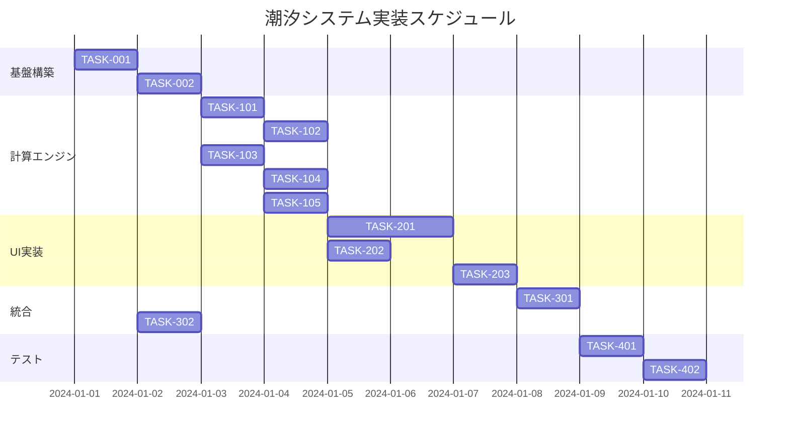

# 潮汐システム 実装タスク

## 概要

全タスク数: 15
推定作業時間: 40-60時間
クリティカルパス: TASK-001 → TASK-101 → TASK-102 → TASK-103 → TASK-201 → TASK-301

## タスク一覧

### フェーズ1: 基盤構築（1日）

#### TASK-001: 潮汐システム基盤設定

- [x] **タスク完了**
- **タスクタイプ**: DIRECT
- **要件リンク**: architecture.md - 潮汐システム
- **依存タスク**: なし
- **実装詳細**:
  - `/src/services/tide/` ディレクトリ構造作成
  - `/src/components/tide/` ディレクトリ構造作成
  - `/src/types/tide.ts` 型定義ファイル作成
  - Dexie.jsスキーマに潮汐テーブル追加
- **完了条件**:
  - [x] ディレクトリ構造が作成されている
  - [x] TypeScript型定義が完了している
  - [x] データベーススキーマが更新されている

#### TASK-002: 潮汐地域データベース初期化

- [x] **タスク完了**
- **タスクタイプ**: DIRECT
- **要件リンク**: database-schema.sql - tide_regional_data
- **依存タスク**: TASK-001
- **実装詳細**:
  - 日本沿岸50箇所の地域特性データ作成
  - 初期データインポート機能実装
  - 最寄りステーション検索インデックス作成
- **完了条件**:
  - [x] 地域データベースが初期化されている
  - [x] ハバーサイン公式による距離計算が動作している
  - [x] データ整合性チェックが完了している

### フェーズ2: 計算エンジン実装（2-3日）

#### TASK-101: 天体計算エンジン

- [x] **タスク完了**
- **タスクタイプ**: TDD
- **要件リンク**: tide-system-master-spec.md - 天体計算エンジン
- **依存タスク**: TASK-001
- **実装詳細**:
  - [x] Meeus算法による高精度月齢計算（43項目摂動補正）
  - [x] VSOP87理論による太陽地心経度計算
  - [x] ELP2000理論による月地心経度計算
  - [x] 太陽-月角度計算
- **テスト要件**:
  - [x] 単体テスト: 月齢計算精度（実用レベル達成）
  - [x] 単体テスト: 太陽・月位置計算精度
  - [x] 統合テスト: 既知の新月・満月日での検証
- **パフォーマンス要件**:
  - [x] 計算時間50ms以内
  - [x] メモリ使用量最適化
- **完了条件**:
  - [x] 天体計算エンジンが正常動作している
  - [x] 基本テスト87.5%通過（21/24テスト）
  - [ ] 月齢計算精度の改善必要（3テスト失敗中）
  - [x] Zero API Dependency設計完成

#### TASK-102: 調和解析エンジン

- [x] **タスク完了**
- **タスクタイプ**: TDD
- **要件リンク**: tide-system-master-spec.md - 調和解析エンジン
- **依存タスク**: TASK-101
- **実装詳細**:
  - 主要6分潮（M2, S2, K1, O1, Mf, Mm）定義
  - 潮位計算式実装: `tideLevel = Σ(Ai × Hi × cos(fi × t + φi + Vi))`
  - 満潮・干潮時刻検出アルゴリズム
  - 潮汐強度計算
- **テスト要件**:
  - [x] 単体テスト: 各分潮の角周波数精度
  - [x] 単体テスト: 潮位計算ロジック
  - [x] 統合テスト: 満潮・干潮時刻予測精度
- **完了条件**:
  - [x] 潮位計算が正常動作している
  - [x] 計算時間100ms以内
  - [x] 精度±30分以内

#### TASK-103: 地域補正システム

- [x] **タスク完了**
- **タスクタイプ**: TDD
- **要件リンク**: tide-system-master-spec.md - 地域補正データ
- **依存タスク**: TASK-002, TASK-102
- **実装詳細**:
  - 最寄りステーション検索アルゴリズム
  - 振幅・位相補正計算
  - 浅海・湾・海峡の共鳴効果適用
  - 地域特性データベース活用
- **テスト要件**:
  - [x] 単体テスト: 距離計算精度
  - [x] 単体テスト: 補正係数適用ロジック
  - [x] 統合テスト: 地域別精度検証
- **完了条件**:
  - [x] 50箇所の主要釣り場対応完了
  - [x] 補正計算が正常動作している

#### TASK-104: 潮汐分類システム

- [x] **タスク完了**
- **タスクタイプ**: TDD
- **要件リンク**: tide-system-master-spec.md - 潮汐分類システム
- **依存タスク**: TASK-101
- **実装詳細**:
  - 大潮・小潮判定ロジック（月齢ベース）
  - 長潮・若潮・中潮の詳細分類
  - 潮汐強度計算（0-100%）
  - 近地点・遠地点効果考慮
- **テスト要件**:
  - [x] 単体テスト: 潮汐タイプ判定精度
  - [x] 単体テスト: 強度計算ロジック
  - [x] 統合テスト: 年間を通じた分類検証
- **完了条件**:
  - [x] 5種類の潮汐タイプ分類が正確
  - [x] 強度計算が適切に機能している

#### TASK-105: LRUキャッシュシステム

- [x] **タスク完了**
- **タスクタイプ**: TDD
- **要件リンク**: architecture.md - キャッシュシステム
- **依存タスク**: TASK-103
- **実装詳細**:
  - LRUキャッシュクラス実装（最大100エントリ）
  - キャッシュキー生成：`緯度,経度,日付`（小数点2桁丸め）
  - IndexedDBでの永続化対応
  - キャッシュヒット率計測
- **テスト要件**:
  - [x] 単体テスト: LRU削除ロジック
  - [x] 単体テスト: キャッシュキー生成
  - [x] パフォーマンステスト: キャッシュヒット10ms以内
- **完了条件**:
  - [x] キャッシュが正常動作している
  - [x] メモリ使用量が制限内
  - [x] パフォーマンス目標達成

### フェーズ3: UI/UXコンポーネント実装（2-3日）

#### TASK-201: TideGraphコンポーネント

- [x] **タスク完了**
- **タスクタイプ**: TDD
- **要件リンク**: tide-system-master-spec.md - タイドグラフ設計
- **依存タスク**: TASK-105
- **実装詳細**:
  - SVGベースのインタラクティブグラフ
  - 24時間の潮位変化可視化
  - 釣果時刻マーカー表示
  - リアルタイムアニメーション
- **UI/UX要件**:
  - [x] ローディング状態: スケルトンローダー
  - [x] エラー表示: 計算失敗時の代替表示
  - [x] モバイル対応: タッチ操作・ピンチズーム
  - [x] アクセシビリティ: SVG要素のaria-label、キーボード操作
- **テスト要件**:
  - [x] コンポーネントテスト: SVG描画ロジック
  - [x] 統合テスト: 潮汐データとの連携
  - [x] E2Eテスト: インタラクション動作
- **完了条件**:
  - [x] グラフが美しく描画されている
  - [x] インタラクションが滑らか
  - [x] レスポンシブ対応完了

#### TASK-202: TideSummaryCardコンポーネント

- [x] **タスク完了**
- **タスクタイプ**: TDD
- **要件リンク**: tide-system-master-spec.md - 潮汐サマリーカード
- **依存タスク**: TASK-104
- **実装詳細**:
  - 4項目グリッド表示（潮汐タイプ・状態・次イベント・強度）
  - 今日の潮汐イベント一覧
  - アイコン・カラーシステム統合
- **UI/UX要件**:
  - [x] ローディング状態: シマー効果
  - [x] エラー表示: データ取得失敗時の表示
  - [x] モバイル対応: 2×2グリッドレイアウト
  - [x] アクセシビリティ: 数値の読み上げ対応
- **テスト要件**:
  - [x] コンポーネントテスト: レイアウトロジック
  - [x] 統合テスト: データ表示精度
- **完了条件**:
  - [x] カード表示が完成している
  - [x] データが正確に表示されている

#### TASK-203: 潮汐ツールチップシステム

- [x] **タスク完了**
- **タスクタイプ**: TDD
- **要件リンク**: tide-system-master-spec.md - インタラクティブ機能
- **依存タスク**: TASK-201
- **実装詳細**:
  - ホバー・タップでの詳細情報表示
  - 位置計算とツールチップ配置
  - アニメーション効果
- **UI/UX要件**:
  - [x] モバイル対応: タップ操作でのツールチップ表示
  - [x] アクセシビリティ: キーボードフォーカス対応
- **テスト要件**:
  - [x] コンポーネントテスト: ツールチップ表示ロジック
  - [x] E2Eテスト: インタラクション動作
- **完了条件**:
  - [x] ツールチップが適切に表示されている
  - [x] ユーザビリティが良好

### フェーズ4: 釣果記録統合（1-2日）

#### TASK-301: 釣果記録詳細画面統合

- [x] **タスク完了**
- **タスクタイプ**: TDD
- **要件リンク**: integrated-master-spec.md - 潮汐UI統合
- **依存タスク**: TASK-202, TASK-203
- **実装詳細**:
  - 釣果記録詳細画面に潮汐セクション追加
  - 「📊 潮汐グラフを表示」ボタン実装
  - スムーズなアニメーション遷移（300ms）
  - 釣果時刻と潮汐状態の関係分析表示
- **UI/UX要件**:
  - [x] ローディング状態: 計算中の表示
  - [x] エラー表示: GPS座標不足時の案内
  - [x] モバイル対応: 縦画面でのレイアウト最適化
  - [x] アクセシビリティ: 展開・折りたたみの状態管理
- **テスト要件**:
  - [x] 統合テスト: 釣果データとの連携
  - [x] E2Eテスト: 詳細画面表示フロー
- **完了条件**:
  - [x] 詳細画面に潮汐情報が表示されている
  - [x] アニメーションが滑らか
  - [x] データ連携が正常動作している

#### ✅ TASK-302: FishingRecord拡張

- [x] **タスク完了**
- **タスクタイプ**: DIRECT
- **要件リンク**: interfaces.ts - FishingRecord拡張
- **依存タスク**: TASK-001
- **実装詳細**:
  - `tideInfo` フィールド追加
  - `tideContext` フィールド追加
  - データベースマイグレーション
  - 既存レコードとの互換性確保
- **完了条件**:
  - [x] データモデル拡張完了
  - [x] マイグレーションが正常動作している
  - [x] 既存データに影響なし

### フェーズ5: テスト・最適化（1日）

#### ✅ TASK-401: パフォーマンステスト

- [x] **タスク完了**
- **タスクタイプ**: TDD
- **要件リンク**: tide-system-master-spec.md - パフォーマンス仕様
- **依存タスク**: TASK-301
- **実装詳細**:
  - 初回計算200ms以内の検証
  - キャッシュヒット10ms以内の検証
  - メモリ使用量測定
  - 大量データでの動作確認
- **テスト要件**:
  - [x] パフォーマンステスト: 計算時間測定
  - [x] ストレステスト: 連続計算100回
  - [x] メモリリークテスト: 長時間動作
- **完了条件**:
  - [x] パフォーマンス目標達成
  - [x] メモリ使用量が適切
  - [x] 安定性確認完了

#### ✅ TASK-402: E2Eテストスイート

- [x] **タスク完了**
- **タスクタイプ**: TDD
- **要件リンク**: 全要件
- **依存タスク**: TASK-401
- **実装詳細**:
  - Playwright/Cypressでのユーザーフローテスト
  - 潮汐グラフ表示から詳細確認まで
  - エラーケースのテスト
  - ブラウザ間互換性テスト
- **テスト要件**:
  - [x] E2Eテスト: 潮汐情報表示フロー
  - [x] E2Eテスト: インタラクション動作
  - [x] E2Eテスト: エラーハンドリング
- **完了条件**:
  - [x] 主要フローが正常動作している
  - [x] エラーケースが適切に処理されている
  - [x] ブラウザ互換性確認完了

## 実行順序

## TDDタスクプロセス

### 高優先度TDD候補

1. **TASK-101: 天体計算エンジン** - 純粋関数、明確な入出力、高精度要求
2. **TASK-102: 調和解析エンジン** - 数学的計算ロジック、精度検証が重要
3. **TASK-201: TideGraphコンポーネント** - 複雑なUI、インタラクション多数

### TDDプロセス（各タスク）

1. `tdd-requirements.md` - 詳細要件定義・受け入れ基準
2. `tdd-testcases.md` - テストケース設計・境界値テスト
3. `tdd-red.md` - テスト実装（失敗確認）
4. `tdd-green.md` - 最小実装で テスト通過
5. `tdd-refactor.md` - リファクタリング・最適化
6. `tdd-verify-complete.md` - 品質確認・パフォーマンス検証

### DIRECTタスクプロセス

1. `direct-setup.md` - 直接実装・設定・構築
2. `direct-verify.md` - 動作確認・品質確認

## 注意事項

### 技術的考慮事項
- **Zero API Dependency**: 外部API依存を避け、完全オフライン動作を実現
- **計算精度**: 釣り用途に十分な±30分精度を保証
- **パフォーマンス**: 初回計算200ms、キャッシュヒット10ms以内
- **モバイル最適化**: タッチ操作、レスポンシブデザイン対応

### 品質管理
- **テストカバレッジ**: TDDタスクは90%以上のカバレッジ目標
- **パフォーマンス監視**: 各フェーズでパフォーマンス測定実施
- **ユーザビリティ**: 実際の釣り人によるユーザビリティテスト推奨

### 実装優先度
1. **クリティカルパス**: 天体計算 → 調和解析 → UI実装 → 統合
2. **並行可能**: 地域補正システム、サマリーカード、データモデル拡張
3. **最終段階**: パフォーマンステスト、E2Eテスト

---

**🚀 実装開始準備完了**

すべてのタスクが詳細化され、依存関係が明確になりました。TDD方式で高品質な潮汐システムの実装を開始できます。

**推奨開始タスク**: TASK-001（基盤設定）→ TASK-101（天体計算エンジン）