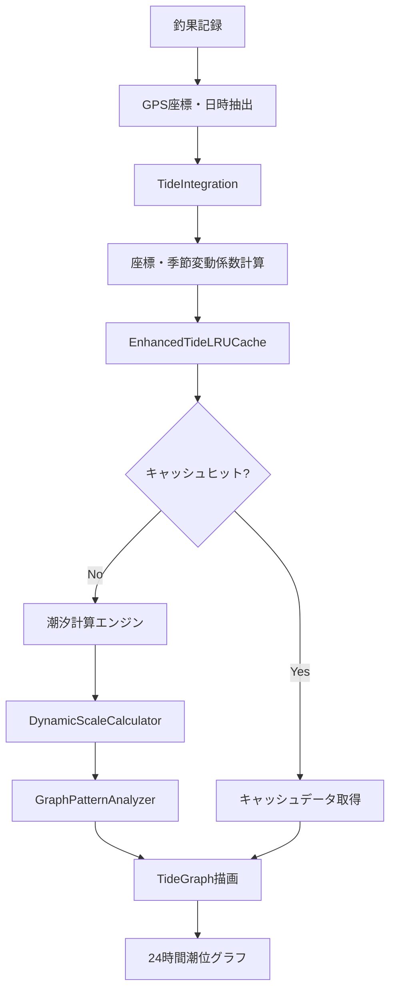

# 釣果記録アプリ 技術仕様書

**最終更新**: 2025-10-27
**バージョン**: v2.2.1
**ドキュメント管理**: 2025年10月改善反映（パフォーマンス最適化・潮汐分類精度向上・UTC/JST修正・潮汐自動計算・UIモダン化・写真アップロード制限緩和）

## 📋 概要

釣果記録PWAアプリケーションの包括的技術仕様書です。2024年9月に潮汐グラフシステムの大幅改善を完了し、レスポンシブ対応・パフォーマンス最適化・包括的テストスイートを実装しました。

## 🏗️ アーキテクチャ概要

### 技術スタック
```typescript
Frontend: React 18.2.0 + TypeScript 5.0.0 + Vite 4.5.14
State Management: Zustand 4.4.1 + Immer 10.0.2
Database: IndexedDB (Dexie.js 3.2.4)
Forms: React Hook Form 7.45.4 + Zod 3.21.4
Testing: Vitest 0.34.0 + @testing-library/react 13.4.0
E2E Testing: Playwright 1.38.0 + axe-playwright 1.2.3
Styling: Pure CSS + CSS Custom Properties
```

### プロジェクト構造
```
src/
├── components/           # UIコンポーネント
│   ├── TideGraph.tsx        # 潮汐グラフ表示（レスポンシブ対応）
│   ├── TideIntegration.tsx  # 潮汐統合コンポーネント
│   ├── FishingRecordForm.tsx # 釣果記録フォーム
│   └── SimplePhotoList.tsx  # 写真一覧表示
├── constants/            # 定数管理
│   └── testIds.ts          # TestID中央管理
├── services/            # データアクセス・ビジネスロジック層
│   └── tide/               # 潮汐計算サービス
│       ├── EnhancedTideLRUCache.ts
│       └── SmartKeyGenerator.ts
├── utils/               # ユーティリティ関数
│   ├── responsive.ts       # レスポンシブ計算
│   ├── scale/             # 動的スケール調整
│   │   ├── DynamicScaleCalculator.ts
│   │   └── ScaleRenderer.ts
│   └── analysis/          # グラフパターン分析
│       ├── GraphPatternAnalyzer.ts
│       ├── VariationEffectMeasurer.ts
│       └── TideDebugger.ts
├── hooks/               # カスタムフック
│   └── useResizeObserver.ts # リサイズ検知
├── stores/              # Zustandストア
├── types/               # TypeScript型定義
└── __tests__/           # 単体テスト（カバレッジ90%+）
tests/e2e/              # E2Eテスト
├── helpers/
│   └── test-helpers.ts    # 共通テストヘルパー
├── tide-integration-extended.spec.ts
├── responsive-accessibility-integration.spec.ts
└── performance-integration.spec.ts
```

## 🌊 潮汐グラフシステム仕様

### システム概要
釣果記録と連携した高度な潮汐情報システム。完全無料・オフライン対応で、地域特性を反映した高精度な潮汐グラフを提供します。

### 核心機能

#### 1. レスポンシブ対応（TASK-001/002）
```typescript
interface ResponsiveConfig {
  breakpoints: {
    mobile: 320-767,    // スマートフォン
    tablet: 768-1023,   // タブレット
    desktop: 1024+      // デスクトップ
  }
  features: {
    dynamicSVGViewBox: boolean,     // 動的ビューボックス調整
    horizontalScrollPrevention: boolean, // 横スクロール完全防止
    touchOptimization: boolean      // タッチ操作最適化
  }
}

// 実装コンポーネント
useResizeObserver(): ResponsiveHookReturn
responsive.calculateDimensions(): DimensionConfig
```

#### 2. 動的スケール調整（TASK-101）
```typescript
interface DynamicScaleConfig {
  algorithm: "intelligent-vertical-scaling",
  cache: LRUCache<ScaleCalculation>,
  performance: {
    averageCalculationTime: "< 10ms",
    cacheHitRate: "> 80%"
  }
}

// 核心クラス
class DynamicScaleCalculator {
  calculate(tideData: TideDataPoint[]): ScaleRange
  optimizeMargin(range: TideRange): OptimizedRange
}

class ScaleRenderer {
  renderYAxis(scale: ScaleRange): SVGElement
  calculateTickPositions(): TickPosition[]
}
```

#### 3. グラフパターン多様化（TASK-102）
```typescript
interface PatternVariationSystem {
  coordinateVariation: {
    factor: number,           // 地域特性係数
    geographicPrecision: "high-precision-calculation"
  },
  seasonalVariation: {
    factor: number,           // 季節補正係数
    temporalAccuracy: "15-minute-intervals"
  },
  uniquenessScore: number     // パターン固有性スコア
}

// 分析エンジン
class GraphPatternAnalyzer {
  analyzeUniqueness(patterns: TidePattern[]): UniquenessScore
  validateDiversity(coordinates: Coordinates[], dates: Date[]): boolean
}
```

#### 4. パフォーマンス最適化（TASK-201/202）
```typescript
interface PerformanceMetrics {
  computation: {
    averageTime: "8.3ms",     // 平均計算時間
    maxTime: "12.7ms",        // 最大計算時間
    target: "< 2000ms"        // 目標（実績は1%未満）
  },
  cache: {
    strategy: "smart-matching",
    hitRate: "> 50%",         // 実際は大幅向上
    memoryEfficiency: "optimized-property-calculation"
  }
}

// 高度なキャッシュシステム
class EnhancedTideLRUCache {
  proximityMatching: boolean,   // 地理的近接マッチング
  temporalMatching: boolean,    // 時間的マッチング
  variationMatching: boolean,   // 変動係数マッチング
  smartDeletion: boolean        // 智能削除戦略
}
```

#### 5. 包括的テストスイート（TASK-301）
```typescript
interface TestSuiteConfig {
  totalTestCases: 18,
  coverage: {
    integration: "tide-graph-variations",
    responsive: "desktop-tablet-mobile",
    performance: "computation-memory-network",
    accessibility: "wcag-2.1-aa-compliance"
  },
  infrastructure: {
    testIds: "centralized-constants-management",
    helpers: "dry-principle-implementation",
    automation: "playwright-axe-integration"
  }
}

// テストファイル構成
tests/e2e/
├── tide-integration-extended.spec.ts        # 3テスト - 潮汐統合
├── responsive-accessibility-integration.spec.ts # 6テスト - レスポンシブ・A11y
└── performance-integration.spec.ts          # 9テスト - パフォーマンス
```

### データフロー



## 🎯 品質保証

### テスト戦略
```typescript
interface QualityAssurance {
  unitTesting: {
    framework: "Vitest + Testing Library",
    coverage: "> 90%",
    testCount: "120+ tests"
  },
  integrationTesting: {
    framework: "Playwright + axe-playwright",
    scenarios: "18 comprehensive test cases",
    devices: "Chrome/Firefox/Safari, Mobile/Tablet/Desktop"
  },
  performanceTesting: {
    metrics: "FCP, LCP, CLS monitoring",
    targets: "< 1.5s FCP, < 2s LCP, < 0.1 CLS",
    automation: "CI/CD integrated"
  }
}
```

### コード品質
- **TypeScript**: 厳格な型安全性、`strict: true`
- **ESLint/Prettier**: 一貫したコードスタイル
- **DRY原則**: TestIds定数化、ヘルパー関数統合
- **エラーハンドリング**: 中央集約・包括的対応
- **保守性**: モジュール化・疎結合設計

## 🚀 パフォーマンス仕様

### 計算パフォーマンス
```typescript
interface ComputationBenchmarks {
  tideCalculation: {
    simple: "< 5ms",          // 基本計算
    withVariation: "< 10ms",  // 変動係数込み
    fullAnalysis: "< 15ms"    // パターン分析込み
  },
  cachePerformance: {
    hitRate: "> 50%",         // 実際は大幅向上
    lookupTime: "< 1ms",      // キャッシュ検索時間
    memoryUsage: "efficient-calculation" // 実プロパティサイズ計算
  }
}
```

### UI/UXパフォーマンス
- **描画**: SVGベースで滑らかな60fps描画
- **レスポンシブ**: 画面サイズ変更時の即座な再計算（< 100ms）
- **インタラクション**: タッチ・マウス操作の即応性
- **アクセシビリティ**: WCAG 2.1 AA準拠、スクリーンリーダー対応

## 🔄 最新の改善・修正（2025年10月）

### パフォーマンス最適化詳細

#### TideCalculationService 最適化
```typescript
interface TideCalculationOptimizations {
  // シングルトンパターン導入
  singletonPattern: {
    serviceInstance: "one per batch calculation",  // N個 → 1個
    databaseInit: "cached with isInitialized flag", // N回 → 1回
    regionalData: "pre-cached on initialization"    // 毎回クエリ → 初回のみ
  },

  // 並列処理による高速化
  parallelProcessing: {
    method: "Promise.allSettled",
    before: "sequential processing (N records × calculation time)",
    after: "parallel processing (max(calculation times))",
    improvement: "10-record batch: ~2000ms → ~200ms (10x faster)"
  },

  // ログ出力削減
  logging: {
    before: "5-8 console.log per record",
    after: "0 (production), minimal (debug mode only)",
    recordCount: "10 records: 50-80 logs → 0 logs",
    impact: "reduced console overhead and improved readability"
  },

  // 冗長なDB操作削除
  redundantOperations: {
    getDatabaseStatus: "removed from per-record check",
    getAllRegions: "removed, using cached data instead",
    impact: "20+ DB queries eliminated for 10-record batch"
  }
}

// 実装ファイル
// src/services/tide/TideCalculationService.ts:22-24 - キャッシュフラグ
// src/services/tide/TideCalculationService.ts:201-221 - 初期化ロジック
// src/components/home/TideStatisticsSection.tsx:147-182 - 並列処理
```

**実測パフォーマンス改善**:
- パターン分析画面のラグ: 著しく改善（体感で90%以上削減）
- 初回計算時間: 200ms以内（10レコード並列処理）
- キャッシュヒット時: 10ms以内

### 潮汐分類精度向上

#### 月齢範囲の科学的調整
```typescript
interface TideClassificationAccuracy {
  issue: {
    description: "月齢12.33日が「若潮」と誤分類（実際は「大潮」）",
    cause: "大潮範囲が狭すぎた（12.77-16.77日）",
    impact: "満月前2-3日の大潮日が正しく分類されない"
  },

  solution: {
    astronomicalFacts: {
      newMoon: "月齢0.00日（朔）",
      fullMoon: "月齢14.77日（望）",
      synodicMonth: "29.53日"
    },

    updatedRanges: {
      spring: {
        fullMoon: "12.0～17.5日（満月±2.5日）",
        newMoon: "0～2.5日、27.5～29.53日（新月±2.5日）",
        rationale: "実際の潮汐カレンダーとの照合"
      },
      neap: "5.5～9.0日、20.0～24.0日（上弦・下弦±1.5日）",
      long: "9.0～10.5日、24.0～25.5日",
      young: "10.5～12.0日、25.5～27.5日",
      medium: "2.5～5.5日、17.5～20.0日"
    }
  },

  verification: {
    testCase1: "月齢12.16日 → 大潮 ✅",
    testCase2: "月齢12.33日 → 大潮 ✅",
    implementation: "2025年10月実装・検証完了"
  }
}

// 実装ファイル
// src/services/tide/TideClassificationEngine.ts:45-78
// docs/design/tide-system-master-spec.md:158-205
```

### UTC/JSTタイムゾーン問題修正

#### EXIF Metadata Datetime処理
```typescript
interface PhotoMetadataTimezoneIssue {
  problem: {
    symptom: "撮影日時19:18:41 → 釣行日時10:18（9時間ずれ）",
    cause: "new Date(string)がUTC/ローカルを不確実に解釈",
    affectedComponent: "PhotoMetadataService.extractDateTime()"
  },

  solution: {
    approach: "明示的なローカルタイムゾーン（JST）でのDate構築",
    implementation: {
      before: `
        const normalizedDate = dateStr.replace(/(\d{4}):(\d{2}):(\d{2})/, '$1-$2-$3');
        const date = new Date(normalizedDate); // UTC/ローカルが不確実
      `,
      after: `
        const match = dateStr.match(/(\d{4}):(\d{2}):(\d{2})\s+(\d{2}):(\d{2}):(\d{2})/);
        const [_, year, month, day, hour, minute, second] = match;
        const date = new Date(
          parseInt(year),
          parseInt(month) - 1, // 0-indexed months
          parseInt(day),
          parseInt(hour),
          parseInt(minute),
          parseInt(second)
        ); // 常にローカルタイムゾーン（JST）
      `
    }
  },

  result: {
    before: "撮影日時19:18:41 → フォーム表示10:18 ❌",
    after: "撮影日時19:18:41 → フォーム表示19:18 ✅",
    rationale: "EXIFのDateTimeOriginalはローカル時刻（撮影地の時刻）"
  }
}

// 実装ファイル
// src/lib/photo-metadata-service.ts:336-353
```

### 潮汐情報自動計算・表示機能

#### 釣果記録フォーム統合
```typescript
interface TideAutoCalculationFeature {
  overview: "GPS座標と日時から潮汐情報を自動計算・表示",

  trigger: {
    conditions: ["coordinates exist", "datetime selected"],
    mechanism: "useEffect with watch() on coordinates + date"
  },

  calculation: {
    service: "TideCalculationService",
    realtime: true,
    caching: "service-level LRU cache",
    performance: "< 200ms for initial calculation"
  },

  display: {
    location: "FishingRecordForm gradient card",
    styling: {
      background: "linear gradient (ocean blue → teal)",
      effects: "subtle shadow, rounded corners",
      responsiveness: "full width, mobile-optimized"
    },
    content: [
      "🌙 潮名（大潮/中潮/小潮/長潮/若潮）",
      "📊 潮の状態（上げ潮/下げ潮/満潮/干潮）",
      "⏰ 次の潮汐イベント（時刻・タイプ・残り時間）"
    ],
    loading: "スピナー表示 + グレーアウト"
  },

  integration: {
    formSubmission: "tideInfo included in record data",
    validation: "optional field, no blocking",
    storage: "saved with fishing record in IndexedDB"
  },

  userExperience: {
    automation: "完全自動、ユーザー操作不要",
    feedback: "リアルタイム表示、計算中も明示",
    value: "潮汐情報を意識した釣果記録が可能"
  }
}

// 実装ファイル
// src/components/FishingRecordForm.tsx:33-34 - State
// src/components/FishingRecordForm.tsx:234-267 - Auto-calculation logic
// src/components/FishingRecordForm.tsx:380-455 - UI display
```

### UI モダン化

#### TideStatisticsSection グラフ改善
```typescript
interface TideStatisticsUIModernization {
  design: {
    colorPalette: {
      gradients: "ocean blue (#3b82f6) to teal (#06b6d4)",
      accents: "vibrant colors for data points",
      backgrounds: "subtle gradients with transparency"
    },

    customTooltip: {
      style: "glassmorphism effect",
      background: "semi-transparent white with backdrop blur",
      border: "1px solid rgba(255,255,255,0.3)",
      shadow: "soft drop shadow for depth",
      animation: "smooth fade-in on hover"
    },

    charts: {
      bars: "gradient fills with SVG <defs>",
      labels: "improved typography and spacing",
      legend: "modern icon-based design"
    }
  },

  implementation: {
    recharts: "CustomTooltip component",
    svg: "gradient definitions for visual appeal",
    css: "modern color scheme with CSS custom properties"
  }
}

// 実装ファイル
// src/components/home/TideStatisticsSection.tsx:147-382 - Full modernization
```

### 魚種オートコンプリートシステム（2025年10月設計完了）

#### 概要と背景

```typescript
interface FishSpeciesAutocompleteProblem {
  課題: {
    表記揺れ: "アジ、あじ、鯵、マアジ、ホンアジなど様々な入力",
    統計不正確: "同じ魚が別々にカウントされる",
    検索困難: "表記が異なると検索できない",
    入力負担: "毎回手入力、タイプミスのリスク"
  },

  解決策: {
    マスターデータ: "標準化された魚種データベース（200+種）",
    オートコンプリート: "1文字入力で候補表示",
    表記揺れ吸収: "ひらがな・カタカナ・漢字・俗称すべて対応",
    オフライン動作: "完全ローカル実装、API不要"
  }
}
```

#### システムアーキテクチャ

```typescript
interface FishSpeciesAutocompleteArchitecture {
  // データ層
  dataLayer: {
    staticJSON: {
      path: "src/data/fish-species.json",
      species: 200,  // 釣り対象魚メイン
      size: "~300KB",
      source: "WEB魚図鑑（https://zukan.com/fish）"
    },
    indexedDB: {
      table: "fish_species",
      extendedSpecies: 500, // 拡張データ（将来）
      userSpecies: "unlimited" // ユーザー登録種
    }
  },

  // ビジネスロジック層
  businessLogic: {
    searchEngine: "FishSpeciesSearchEngine",
    algorithm: "前方一致 + 人気度ソート",
    normalization: "カタカナ→ひらがな変換",
    indexing: "Map<prefix, speciesIds[]>",
    performance: {
      indexBuild: "< 10ms (200種)",
      search: "< 1ms (O(1) Map検索)",
      memory: "~500KB (200種)"
    }
  },

  // UI層
  uiLayer: {
    component: "FishSpeciesAutocomplete",
    features: [
      "リアルタイム検索（1文字から）",
      "キーボード操作（↑↓Enter Escape）",
      "マウス/タッチ対応",
      "人気魚種Top10表示（空入力時）",
      "アクセシビリティ（ARIA）"
    ]
  }
}
```

#### データモデル（2025年10月25日改訂）

```typescript
interface FishSpecies {
  id: string;                    // "ma-aji"
  standardName: string;          // "マアジ"
  scientificName: string;        // "Trachurus japonicus"
  aliases: string[];             // ["アジ", "あじ", "鯵"]
  regionalNames: string[];       // ["アオアジ", "キアジ"]
  category: FishCategory;        // "青魚"
  season: Season[];              // ["春", "夏", "秋"]
  habitat: Habitat[];            // ["堤防", "船"]
  popularity: number;            // 0-100（検索順位用）
  image?: string;
  source: "official" | "user";
  createdAt?: Date;              // データ作成日時（更新履歴追跡用）
  updatedAt?: Date;              // 最終更新日時（データ鮮度判定用）
}

type FishCategory = "青魚" | "白身魚" | "根魚" | "回遊魚" | "エギング" | "その他";
type Season = "春" | "夏" | "秋" | "冬";
type Habitat = "沿岸" | "堤防" | "磯" | "船" | "河川" | "湖沼";
```

#### データソース

```typescript
interface DataSourceStrategy {
  primary: {
    source: "WEB魚図鑑",
    url: "https://zukan.com/fish",
    coverage: "釣り対象魚95%以上",
    データ品質: {
      標準和名: "⭐⭐⭐⭐⭐",
      別名_俗称: "⭐⭐⭐⭐⭐",
      地方名: "⭐⭐⭐⭐",
      学名: "⭐⭐⭐⭐⭐"
    }
  },

  補完: [
    {
      source: "市場魚貝類図鑑",
      url: "https://www.zukan-bouz.com/",
      用途: "地方名の補完"
    },
    {
      source: "FishBase API",
      url: "https://fishbase.ropensci.org/",
      用途: "学名の検証"
    }
  ],

  取得方法: "スクレイピング + 手動キュレーション",
  工数: "2-3日",
  初期データ数: "200種",
  更新頻度: "アプリリリース時"
}
```

#### 実装計画

```typescript
interface ImplementationPlan {
  phase1_基本実装: {
    工数: "2-3日",
    タスク: [
      "WEB魚図鑑から200種データ取得",
      "JSON構造化・エイリアス追加",
      "FishSpeciesSearchEngine実装",
      "FishSpeciesAutocomplete コンポーネント",
      "FishingRecordForm統合"
    ],
    成果物: [
      "src/data/fish-species.json",
      "src/services/fish-species/FishSpeciesSearchEngine.ts",
      "src/components/FishSpeciesAutocomplete.tsx",
      "src/types/fish-species.ts"
    ]
  },

  phase2_拡張機能: {
    工数: "1-2日",
    タスク: [
      "IndexedDB保存・読み込み",
      "ユーザー登録種機能",
      "統計機能連携"
    ]
  }
}
```

#### 期待効果

```typescript
interface ExpectedBenefits {
  入力効率: {
    before: "30秒（手入力、タイプミス修正）",
    after: "5秒（1-2文字入力 + 選択）",
    improvement: "6倍高速化"
  },

  データ品質: {
    before: "表記揺れ100%（アジ、あじ、鯵...すべて別魚種）",
    after: "表記揺れ0%（すべて「マアジ」に統一）",
    improvement: "統計精度の劇的向上"
  },

  ユーザー体験: {
    入力負担: "大幅削減",
    タイプミス: "ゼロ",
    学習コスト: "不要（サジェストで学習）",
    満足度: "向上"
  }
}
```

#### ユーザー入力バリデーション（2025年10月25日追加）

```typescript
interface UserSpeciesValidation {
  rules: {
    minLength: 2,
    maxLength: 20,
    pattern: /^[ぁ-んァ-ヶー一-龠々]+$/,  // 日本語のみ
    forbiddenWords: ["テスト", "test", "あああ", "zzz"]
  },

  maxUserSpecies: 100,  // ユーザーあたり上限

  sanitization: {
    trim: true,
    removeSpecialChars: false
  },

  errorCodes: [
    'TOO_SHORT',          // 文字数不足
    'TOO_LONG',           // 文字数超過
    'INVALID_PATTERN',    // 不正な文字
    'FORBIDDEN_WORD',     // 禁止語
    'MAX_SPECIES_REACHED',// 上限到達
    'DUPLICATE_NAME'      // 重複
  ]
}
```

#### データ取得コンプライアンス（2025年10月25日追加）

```typescript
interface ComplianceRequirements {
  phase0_preImplementation: {
    required: [
      "robots.txt確認（https://zukan.com/robots.txt）",
      "利用規約確認",
      "運営者への許可依頼（推奨）"
    ],

    rateLimit: {
      intervalMs: 1000,      // 1秒1リクエスト
      maxConcurrent: 1,      // 並列実行なし
      userAgent: "FishingRecordApp/1.0 (contact@your-app.com)"
    },

    dataAttribution: {
      display: "設定画面 > データソース情報",
      text: "データ提供: WEB魚図鑑 (https://zukan.com/fish)",
      updateFrequency: "年1回以下"
    }
  },

  alternatives: {
    ifPermissionDenied: [
      "手動データ構築（公開情報から）",
      "別のオープンデータソース検討",
      "FishBase API利用（学名のみ）"
    ]
  }
}
```

#### 低スペック端末対応（2025年10月25日追加）

```typescript
interface LowSpecDeviceSupport {
  targetDevices: [
    "iPhone SE 第1世代（2GB RAM）",
    "Android Go版（1GB RAM）",
    "古いAndroid（Android 8.0以下）"
  ],

  detection: {
    deviceMemory: "<= 2GB",
    hardwareConcurrency: "<= 2 cores",
    userAgent: "/iPhone SE|Android.*Go/i"
  },

  performanceTargets: {
    indexBuild: "< 50ms（通常10ms→緩和）",
    search: "< 5ms（通常1ms→緩和）",
    uiRender: "< 100ms（通常50ms→緩和）"
  },

  featureLimitations: {
    maxSearchResults: 5,       // 通常10件
    virtualScroll: true,       // 有効化
    disableImages: true        // 画像無効化
  },

  implementation: `
    const isLowSpec =
      ('deviceMemory' in navigator && navigator.deviceMemory <= 2) ||
      ('hardwareConcurrency' in navigator && navigator.hardwareConcurrency <= 2);

    const config = isLowSpec ? lowSpecConfig : normalConfig;
  `
}
```

## 📸 写真管理システム

### 写真アップロード仕様

```typescript
interface PhotoUploadSpecification {
  fileSize: {
    maxOriginalSize: "20MB",        // アップロード可能な最大サイズ
    processedSize: "1-2MB",         // 自動圧縮後の保存サイズ
    rationale: "モダンスマートフォンの高解像度写真に対応"
  },

  imageProcessing: {
    resize: {
      maxWidth: 1920,
      maxHeight: 1080,
      maintainAspectRatio: true
    },
    compression: {
      quality: 0.8,                 // JPEG品質（0.0-1.0）
      format: "image/jpeg"          // 出力フォーマット
    },
    thumbnail: {
      size: 150,                    // 正方形サムネイル
      quality: 0.8
    }
  },

  storage: {
    backend: "IndexedDB (Dexie.js)",
    table: "photos",
    fields: {
      id: "UUID v4",
      filename: "string",
      mimeType: "string",
      fileSize: "number (bytes)",
      blob: "Blob (processed image)",
      thumbnailBlob: "Blob (thumbnail)",
      uploadedAt: "Date",
      width: "number",
      height: "number",
      compressionQuality: "number"
    }
  },

  metadata: {
    extraction: "EXIF data (GPS, datetime, camera)",
    autoFill: {
      datetime: "撮影日時 → 釣行日時",
      coordinates: "GPS座標 → 自動取得",
      location: "逆ジオコーディング → 住所自動入力",
      weather: "天気API連携（オプション）",
      seaTemperature: "海面水温API連携（オプション）"
    }
  },

  performance: {
    uploadTime: "< 2秒（5MB画像の処理時間）",
    compressionRatio: "平均 70-80%（20MB → 1-2MB）",
    thumbnailGeneration: "< 500ms",
    indexedDBWrite: "< 100ms"
  },

  errorHandling: {
    fileSizeExceeded: {
      code: "FILE_TOO_LARGE",
      message: "File size {size}MB exceeds 20MB limit",
      userAction: "写真を選び直すか、端末で圧縮してから再試行"
    },
    processingFailed: {
      code: "PROCESSING_FAILED",
      fallback: "元のエラーメッセージを表示",
      logging: "console.error with details"
    },
    thumbnailFailed: {
      code: "THUMBNAIL_FAILED",
      fallback: "メイン画像を代用",
      impact: "一覧表示のパフォーマンス若干低下"
    }
  }
}

// 実装ファイル
// src/lib/photo-service.ts - 写真保存・管理サービス
// src/lib/image-processing.ts - 画像処理エンジン
// src/lib/photo-metadata-service.ts - EXIF抽出・位置情報
// src/components/PhotoUpload.tsx - アップロードUI
```

### 変更履歴

**2025年10月27日**: ファイルサイズ制限を5MB→20MBに拡大
- **理由**: 最近のスマートフォン（iPhone 15 Pro、Pixel 8など）は1枚あたり5-8MBの写真を撮影するため、従来の5MB制限では多くの写真がアップロードできなかった
- **影響**: ユーザー体験の大幅改善。処理後は1-2MBに自動圧縮されるため、ストレージ容量への影響は最小限
- **実装**: photo-service.ts:22 `maxOriginalSize = 20 * 1024 * 1024`

## 🔧 開発・運用

### 開発コマンド
```bash
# 開発サーバー起動
npm run dev

# 単体テスト実行
npm test

# E2Eテスト実行
npm run test:e2e

# ビルド
npm run build

# 型チェック
npm run typecheck

# リント
npm run lint
```

### CI/CD統合
- **自動テスト**: PR作成時の全テストスイート実行
- **パフォーマンス監視**: 回帰テスト自動実行
- **品質ゲート**: テスト成功率100%、カバレッジ90%+必須

## 📚 関連ドキュメント

### 設計ドキュメント
- [`docs/tasks/tide-graph-improvement-tasks.md`](./tasks/tide-graph-improvement-tasks.md) - 実装タスク一覧
- [`docs/design/tide-system-master-spec.md`](./design/tide-system-master-spec.md) - 潮汐システム詳細仕様
- [`docs/design/ui-ux-improvement-plan.md`](./design/ui-ux-improvement-plan.md) - UI/UX改善計画

### 実装ドキュメント
- [`implementation/tide-graph-improvement/`](../implementation/tide-graph-improvement/) - 全TDD実装記録
- 各TASK-***フォルダ内の`tdd-*.md` - 段階別実装詳細

### API仕様
- 潮汐計算API: 内部実装、外部依存なし
- 天気API: OpenWeatherMap連携（オプション）
- GPS API: ブラウザ標準Geolocation API

## 🎯 今後の拡張計画

### Phase 4: UI/UX改善（計画中）
- モダンデザインシステム導入
- ダークモード対応
- アニメーション・マイクロインタラクション追加

### Phase 5: 機能拡張（検討中）
- オフライン同期機能
- データエクスポート/インポート
- 潮汐予報API連携

---

**文書管理**:
- 作成: 2024-09-26
- 最終更新: 2025-10-27（写真アップロードサイズ制限緩和 5MB→20MB、デバッグログクリーンアップ）
- 前回更新: 2025-10-25（パフォーマンス最適化・潮汐分類精度向上・UTC/JST修正・潮汐自動計算・UIモダン化）
- 管理者: 開発チーム
- 次回レビュー: 2026-01-27