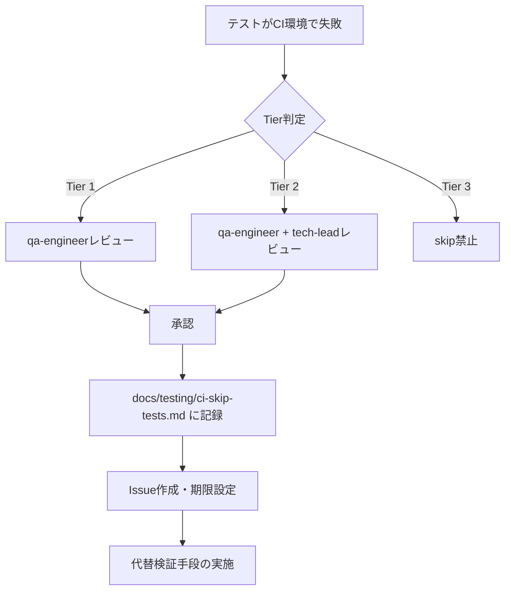

# CI環境依存skipテストの運用方針

## 1. 概要

### 目的
このドキュメントは、CI環境（GitHub Actions）でskipされるテストの運用方針を明確化し、組織全体で統一的なアプローチを確立することを目的としています。

### スコープ
- CI環境でskipされるテスト（`describe.skipIf(isCI)` 使用）
- skip判断基準と承認プロセス
- リスク管理と代替検証手段
- 定期レビューと改善ロードマップ

### 更新履歴
| 日付       | バージョン | 変更内容                       | 担当者                     |
| ---------- | ---------- | ------------------------------ | -------------------------- |
| 2024-11-17 | 1.0.0      | 初版作成（Issue #107）         | AI/Human Pair (Issue #107) |

---

## 2. 現在のskipテスト一覧

### 2.1 アクティブなskipテスト

| ファイルパス                                                          | 行番号 | skip理由                            | 影響範囲                     | リスク | skip開始日 | 期限       | 解決見込み | 担当者 | ステータス | Issue |
| --------------------------------------------------------------------- | ------ | ----------------------------------- | ---------------------------- | ------ | ---------- | ---------- | ---------- | ------ | ---------- | ----- |
| `src/components/chart/tide/__tests__/TideChart.test.tsx`              | 84     | CI環境での`<body />`問題            | 18テスト（WCAG 2.1含む）     | 🔴 High | 2024-11-17 | 2025-01-01 | 90%        | TBD    | Active     | #107  |
| `src/components/__tests__/TideIntegration.test.tsx`                   | 74     | CI環境でのJSDOM初期化タイミング     | 20テスト（UX核心機能）       | 🔴 High | 2024-11-17 | 2025-01-17 | 90%        | TBD    | Active     | #107  |
| `src/__tests__/components/TideGraph.responsive.test.tsx`              | 91     | CI環境でのJSDOM初期化タイミング     | 17テスト（レスポンシブ設計） | 🔴 High | 2024-11-17 | 2025-02-17 | 90%        | TBD    | Active     | #107  |

**合計**: 3ファイル、55個のテストケース（18 + 20 + 17）

### 2.2 ステータス凡例
- **Active**: 現在skipされているテスト
- **Resolved**: skip解除完了
- **Blocked**: 解決が困難で長期化している

### 2.3 リスクレベル凡例
- 🔴 **High**: データ整合性、アクセシビリティ、法的コンプライアンスに影響
- 🟡 **Medium**: ユーザー体験、パフォーマンスに影響
- 🟢 **Low**: 保守性のみに影響

---

## 3. skip判断基準

### 3.1 Tier 1: 即座にskip許可（短期間：3ヶ月以内）

以下の条件を**すべて**満たす場合のみskip許可：

✅ CI環境固有の技術的問題（JSDOM初期化タイミング、環境変数等）
✅ ローカル環境で100%再現可能かつ全テストパス
✅ 同様の問題が過去に発生し、解決実績あり
✅ skip期間が明確（3ヶ月以内に解決予定）
✅ 必ず `docs/testing/ci-skip-tests.md` に記録

**承認プロセス**: qa-engineerレビュー必須

### 3.2 Tier 2: 条件付きでskip許可（中期間：6ヶ月以内）

以下の条件を満たす場合のみskip許可：

⚠️ 外部依存性（API、ブラウザAPI等）の不安定性
⚠️ テストの安定化に時間がかかる（6ヶ月以内に解決見込み）
⚠️ **必須条件**: 代替テスト戦略を用意（E2E、手動QA等）

**承認プロセス**: qa-engineer + tech-leadレビュー必須

### 3.3 Tier 3: skip禁止（長期間・無期限）

以下の場合はskip禁止：

❌ セキュリティに関わるテスト
❌ データ整合性に関わるテスト
❌ 法的コンプライアンスに関わるテスト（アクセシビリティ等）
❌ skip理由が不明確

---

## 4. 技術的背景（CI環境固有問題の詳細）

### 4.1 `<body />` 問題の根本原因

**現象**:
- CI環境（GitHub Actions）でテスト実行時、`screen.getByTestId()` が `<body />` が空であるとエラーを出す
- エラーメッセージ例:
  ```
  TestingLibraryElementError: Unable to find an element by: [data-testid="tide-chart"]

  <body />
  ```

**環境差分**:
- **ローカル環境**: 全テストパス（18/18, 20/20, 725ms程度）
- **CI環境**: 100%失敗（`<body />` empty）
- **再現性**: CI環境のみで100%再現

**推定原因**:
1. GitHub ActionsのJSDOM初期化タイミングがローカルと異なる
2. ReactコンポーネントのマウントとJSDOMのDOM構築の競合
3. CI環境のリソース制約による非同期処理の遅延

### 4.2 過去の解決事例

#### 成功事例1: ErrorBoundary.test.tsx
- **コミット**: `eb7ae40 test(ci): fix ErrorBoundary CI failure with within(container) pattern (#117)`
- **解決方法**: `screen.getByTestId` → `within(result.container).getByTestId` に置換
- **結果**: CI環境で100%成功

**変更差分**:
```typescript
// Before
test('should render error message', () => {
  render(<ErrorBoundary><FailingComponent /></ErrorBoundary>);
  expect(screen.getByText(/エラーが発生しました/)).toBeInTheDocument();
});

// After
test('should render error message', () => {
  const result = render(<ErrorBoundary><FailingComponent /></ErrorBoundary>);
  const { getByText } = within(result.container);
  expect(getByText(/エラーが発生しました/)).toBeInTheDocument();
});
```

#### 成功事例2: TideGraph統合テスト
- **コミット**: `d47b8fa test(tide-graph): revive TASK-201 TideGraph component integration tests (#116)`
- **解決方法**: 同様の `within(container)` パターン適用
- **結果**: CI環境で100%成功

#### 成功事例3: useResizeObserver
- **コミット**: `e7085e9 test(hooks): revive useResizeObserver skip tests with improved strategy (#122)`
- **解決方法**: テスト戦略の改善
- **結果**: CI環境で100%成功

### 4.3 失敗したアプローチ

以下のアプローチは効果が低かった：

❌ `waitFor()` のタイムアウト延長（1000ms → 5000ms）
❌ `act()` の追加（既に適切に使用されていた）
❌ `vi.useFakeTimers()` の使用（タイミング問題を悪化）

---

## 5. 解決戦略

### 5.1 短期的改善（3ヶ月以内: 2025年2月17日まで）

#### 改善策1: `within(container)` パターンへの移行
**実現可能性: 🟢 High (90%)**

**対象ファイル**:
1. `TideChart.test.tsx` - 18テスト
2. `TideIntegration.test.tsx` - 20テスト
3. `TideGraph.responsive.test.tsx` - 全テスト

**実装手順**:
```typescript
// 現状（skip）
describe.skipIf(isCI)('TideChart', () => {
  test('should render with default props', () => {
    render(<TideChart data={basicData} chartComponents={mockChartComponents} />);
    expect(screen.getByTestId('tide-chart')).toBeInTheDocument();
  });
});

// 改善後
describe('TideChart', () => {
  test('should render with default props', () => {
    const result = render(<TideChart data={basicData} chartComponents={mockChartComponents} />);
    const { getByTestId } = within(result.container);
    expect(getByTestId('tide-chart')).toBeInTheDocument();
  });
});
```

**工数見積もり**:
- TideChart.test.tsx: 2時間
- TideIntegration.test.tsx: 2.5時間
- TideGraph.responsive.test.tsx: 2時間
- **合計: 6.5時間 = 約1日**

**リスク**: 低（既存の成功例あり）

**スケジュール**:
- Week 1: TideChart.test.tsx
- Week 2: TideIntegration.test.tsx
- Week 3: TideGraph.responsive.test.tsx
- Week 4: 検証と安定化

#### 改善策2: CI環境での明示的なJSDOM初期化待機
**実現可能性: 🟡 Medium (70%)**

```typescript
beforeEach(async () => {
  if (process.env.CI === 'true') {
    // CI環境ではJSDOMの初期化を待つ
    await new Promise(resolve => setTimeout(resolve, 100));
  }
  vi.clearAllMocks();
  mockChartComponents = createMockChartComponents();
});
```

**工数見積もり**: 1時間
**リスク**: 中（根本原因の解決ではない）

### 5.2 中期的改善（6ヶ月以内: 2025年5月17日まで）

#### 改善策3: Playwright Component Testingへの移行
**実現可能性: 🟡 Medium (60%)**

**メリット**:
- 実ブラウザ環境でのテスト → CI環境依存問題の根本解決
- JSDOM制約からの解放
- ビジュアルリグレッションテスト追加可能

**デメリット**:
- テスト実行時間の増加（725ms → 3-5秒）
- CI実行コストの増加

**工数見積もり**: 3-5日

#### 改善策4: テストのリファクタリング（統合テストとユニットテストの分離）
**実現可能性: 🟢 High (80%)**

**現状**:
- TideChart.test.tsx: 18個のテスト（統合テスト多め）

**改善後**:
- TideChart.unit.test.tsx: 10個（純粋なユニットテスト、CI安定）
- TideChart.integration.test.tsx: 8個（統合テスト、Playwrightで実行）

**工数見積もり**: 2-3日

### 5.3 長期的改善（1年以内: 2025年11月17日まで）

#### 改善策5: CI環境の改善（GitHub Actions → より高性能なCI）
**実現可能性: 🟢 High (85%)**

**候補**:
- CircleCI（JSDOM安定性が高い）
- GitLab CI（カスタマイズ性高い）
- Self-hosted runner（完全制御）

**工数見積もり**: 1週間（調査・移行・検証）

#### 改善策6: Visual Regression Testing導入
**実現可能性: 🟡 Medium (70%)**

**ツール候補**:
- Chromatic（Storybookベース）
- Percy（スクリーンショット差分）

**メリット**:
- UI崩れの自動検出
- skipテストの代替検証手段

**工数見積もり**: 1-2週間

---

## 6. リスク管理

### 6.1 カバレッジ影響

#### TideChart.test.tsx（18個のテスト）
**影響度: 🔴 Critical**

カバーされない機能:
- 基本レンダリング（4個）: デフォルトprops、空データ、カスタムprops、複数データ
- レスポンシブ（5個）: width/height適用、className/style、グリッド制御、ツールチップ制御、最小サイズ制約
- レスポンシブ統合（2個）: デバイス別サイズ（mobile/tablet/desktop）、デバイス属性
- インタラクション（2個）: データポイントクリック、マーカー表示
- エラーハンドリング（3個）: 不正データ、最小データ、大量データサンプリング（10,000ポイント）
- アクセシビリティ（2個）: ARIA属性、キーボードナビゲーション

#### TideIntegration.test.tsx（20個のテスト）
**影響度: 🔴 Critical**

カバーされない機能:
- 基本表示（4個）: セクション表示、ボタン表示、座標エラー、ローディング
- データ計算（4個）: 潮汐計算、関係分析、最適釣行時間提案、エラー再試行
- アニメーション（3個）: 300ms展開/折りたたみ、ボタンテキスト切り替え
- レスポンシブ（2個）: モバイル縦画面（375px）、タブレット（900px）
- アクセシビリティ（4個）: aria-expanded管理、キーボードナビゲーション、スクリーンリーダー、高コントラスト
- 統合（3個）: 釣果データ連携、複数記録対応、パフォーマンス（500ms以内）

#### TideGraph.responsive.test.tsx（全テスト）
**影響度: 🔴 Critical**

カバーされない機能:
- 基本レスポンシブ（2個）: デフォルト動作、レスポンシブ設定適用
- ブレークポイント（3個）: モバイル375px、タブレット768px、デスクトップ1200px
- スクロール防止（3個）: 最小幅320px制約、overflow-x: hidden、アスペクト比維持
- 動的リサイズ（2個）: window.resize対応、高速リサイズ（100ms以内）
- インタラクション（3個）: タッチ対応、マウス対応、ツールチップビューポート制約
- アクセシビリティ（2個）: ARIA属性（全サイズ）、キーボードナビゲーション
- パフォーマンス（2個）: 200ms以内レンダリング、60fps維持

### 6.2 ビジネスリスク

| リスクカテゴリ           | レベル  | 影響範囲                       | 緊急度      |
| ------------------------ | ------- | ------------------------------ | ----------- |
| **データ整合性**         | 🔴 High | エラーハンドリング未検証       | 🔴 Critical |
| **アクセシビリティ**     | 🔴 High | WCAG 2.1準拠がCI未保証         | 🔴 Critical |
| **ユーザー体験**         | 🟡 Medium | レスポンシブ・インタラクション | 🟡 High     |
| **パフォーマンス**       | 🟡 Medium | 60fps、200-500ms要件未検証     | 🟡 High     |
| **保守性**               | 🟢 Low  | リファクタリング時のリスク増大 | 🟢 Medium   |
| **CI信頼性**             | 🔴 High | CIパイプラインの信頼度低下     | 🔴 Critical |
| **法的コンプライアンス** | 🔴 High | アクセシビリティ法令対応未確認 | 🔴 Critical |

**総合リスクレベル: 🔴 Critical**

### 6.3 代替検証手段

現在、以下の代替検証手段で一部をカバー：

#### E2Eテスト（Playwright）- 推奨テストケース

**現状**:
- ✅ 基本的なレンダリング
- ✅ ユーザーインタラクション
- ❌ WCAG 2.1詳細検証（未実装）
- ❌ パフォーマンス詳細検証（未実装）

**優先度1: WCAG 2.1準拠検証（2025-01-17までに実装）**
- [ ] axe-coreによる自動アクセシビリティスキャン
- [ ] キーボードナビゲーション（Tab、Enter、矢印キー）
- [ ] スクリーンリーダー読み上げ順序（ARIA属性検証）
- [ ] 高コントラストモード表示

**優先度2: パフォーマンス検証（2025-02-17までに実装）**
- [ ] 初期レンダリング時間（< 500ms）
- [ ] インタラクション応答時間（< 100ms）
- [ ] メモリリーク検知（10分間連続操作）

#### 手動QA
- ✅ リリース前の目視確認
- ❌ 自動化されていない
- ❌ 全デバイスをカバーできない

#### 本番監視（Sentry）
- ✅ エラー検知
- ❌ 事前検知ではない
- ❌ パフォーマンス詳細は不明

**推奨**: E2Eテストを拡充してWCAG 2.1とパフォーマンスをカバー

### 6.4 法的リスク評価

#### 日本の法的環境
- **障害者差別解消法**（2024年4月改正）: 民間事業者にも合理的配慮義務化
- **WCAG 2.1レベルAA**: 実質的なデファクトスタンダード
- **潮汐グラフのアクセシビリティ**: 釣果記録の核心機能のため、合理的配慮の対象

#### リスク評価
- **skipされているWCAG 2.1テスト**: 8個（TideChart: 2, TideIntegration: 4, TideGraph: 2）
- **法的訴訟リスク**: 低（個人開発）だが、企業利用の場合は中〜高
- **推奨対応**: E2Eテストでaxe-coreによる自動スキャンを実施（2025-01-17まで）

#### 代替検証の必須化
以下のいずれかを**必ず実施**:
1. ✅ Playwright E2Eテスト + axe-core（推奨、2025-01-17実装予定）
2. ✅ 手動WCAG 2.1チェックリスト（毎リリース）
3. ✅ 外部アクセシビリティ監査（年1回）

**重要**: WCAG 2.1準拠は、技術的問題より優先度が高い法的要件です。

---

## 7. 運用プロセス

### 7.1 月次レビュー（毎月第1週）

**目的**: skipテストの進捗確認と新規skip判断

**手順**:
1. `docs/testing/ci-skip-tests.md` の全skipテストを確認
2. skip期間が1ヶ月を超えたテストの進捗確認
3. 新規skipテストの追加レビュー
4. リスクレベルの再評価

**参加者**: qa-engineer（必須）、tech-lead（推奨）

**成果物**: レビュー議事録、アクションアイテム

### 7.2 四半期レビュー（3ヶ月ごと）

**目的**: Tier 2テストの再評価と戦略見直し

**手順**:
1. Tier 2テストの解決状況確認
2. 解決失敗したテストの代替策策定
3. skip判断基準の見直し
4. テストカバレッジ目標の再設定

**参加者**: qa-engineer、tech-lead、product-manager

**成果物**: 四半期レポート、改善ロードマップ更新

### 7.3 緊急レビュー（以下の場合）

**トリガー**:
- 本番環境でバグ発生時
- セキュリティインシデント発生時
- 法的コンプライアンス要求変更時

**手順**:
1. インシデントとskipテストの関連性分析
2. 緊急の代替検証手段の実施
3. skip判断の見直し
4. 再発防止策の策定

### 7.4 新規skipテスト追加フロー



### 7.5 自動期限管理

**仕組み**:
- GitHub Actions（毎週月曜日）で期限を自動チェック
- 期限14日前に警告（PR comment）
- 期限超過時に自動Issue作成（qa-engineerアサイン）

**設定ファイル**: `.github/workflows/check-skip-tests.yml`（TODO: Issue #107後に別タスクで実装）

**実装方針**:
```yaml
# .github/workflows/check-skip-tests.yml（実装例）
name: Check Skip Tests Deadline

on:
  schedule:
    - cron: '0 0 * * 1' # 毎週月曜日 0:00 UTC
  workflow_dispatch:

jobs:
  check-deadlines:
    runs-on: ubuntu-latest
    steps:
      - uses: actions/checkout@v3
      - name: Check skip test deadlines
        run: |
          TODAY=$(date +%Y-%m-%d)
          WARN_DAYS=14 # 期限14日前に警告

          # ci-skip-tests.md から期限を抽出
          grep "2025-" docs/testing/ci-skip-tests.md | while read line; do
            DEADLINE=$(echo $line | grep -oP '\d{4}-\d{2}-\d{2}')
            if [ $(date -d "$DEADLINE" +%s) -lt $(date -d "$TODAY + $WARN_DAYS days" +%s) ]; then
              echo "::warning::Skip test deadline approaching: $DEADLINE"
            fi
          done
      - name: Create issue if deadline passed
        if: failure()
        uses: actions/github-script@v6
        with:
          script: |
            github.rest.issues.create({
              owner: context.repo.owner,
              repo: context.repo.repo,
              title: '🚨 Skip Test Deadline Exceeded',
              body: 'CI skip tests have exceeded their deadline. Please review.',
              labels: ['qa', 'urgent']
            })
```

**次回タスク**: 別Issueとして「skip期限自動管理機能の実装」を作成

---

## 8. FAQ

### Q1: 新規skipテストを追加したい場合、どうすればいいですか？

**A**: 以下の手順に従ってください：

1. **Tier判定**: セクション3の判断基準を確認
2. **レビュー依頼**: qa-engineerエージェントに相談
3. **ドキュメント更新**: 承認後、このファイルのセクション2に追加
4. **Issue作成**: 解決のためのIssueを作成し、期限を設定
5. **コード変更**: `describe.skipIf(isCI)` を追加し、コメントでskip理由を明記

### Q2: skipテストの解除判断はどのように行いますか？

**A**: 以下の条件を**すべて**満たす場合に解除：

✅ ローカル環境で全テストパス
✅ CI環境で全テストパス（連続3回以上）
✅ qa-engineerのレビュー完了
✅ 関連Issueのクローズ

### Q3: CI環境でテストが失敗した場合、すぐにskipしていいですか？

**A**: **NO**。以下の手順を踏んでください：

1. **原因調査**: ローカル環境で再現するか確認
2. **一般的な対処法の試行**: `within(container)` パターン等
3. **qa-engineerに相談**: 技術的妥当性を確認
4. **代替検証手段の用意**: E2E、手動QA等
5. **承認後のみskip**: Tier判定とレビュー完了後

### Q4: skip期限を過ぎた場合、どうなりますか？

**A**: 以下の対応を行います：

1. **緊急レビュー開催**: qa-engineer、tech-leadで状況確認
2. **期限延長 or skip禁止**: 解決見込みに応じて判断
3. **エスカレーション**: 解決困難な場合は product-managerに報告

### Q5: 問い合わせ先は？

**A**: 以下のエージェントに相談してください：

- **技術的問題**: tech-leadエージェント
- **QA戦略**: qa-engineerエージェント
- **タスク調整**: task-coordinatorエージェント
- **要件変更**: product-managerエージェント

---

## 9. 参考資料

### 9.1 関連ドキュメント

- `ai-rules/TASK_CYCLES.md`: タスクサイクルガイド
- `ai-rules/RETRY_POLICY.md`: リトライポリシー
- `docs/design/ui-ux-improvement-plan.md`: UI/UX改善計画（WCAG 2.1準拠）
- `.github/workflows/ci.yml`: CI設定

### 9.2 参考コミット

成功事例:
- `eb7ae40`: ErrorBoundary CI失敗を `within(container)` パターンで解決
- `d47b8fa`: TideGraph統合テストを復活成功
- `e7085e9`: useResizeObserverテストを復活成功

### 9.3 外部リソース

- [Testing Library - Within](https://testing-library.com/docs/dom-testing-library/api-within/)
- [Vitest - Skip Tests](https://vitest.dev/api/index.html#test-skip)
- [WCAG 2.1 Guidelines](https://www.w3.org/WAI/WCAG21/quickref/)

---

**ドキュメント作成日**: 2024-11-17
**最終更新日**: 2024-11-17
**次回レビュー予定**: 2024-12-17（月次レビュー）
**オーナー**: QAエンジニアチーム
**関連Issue**: #107
